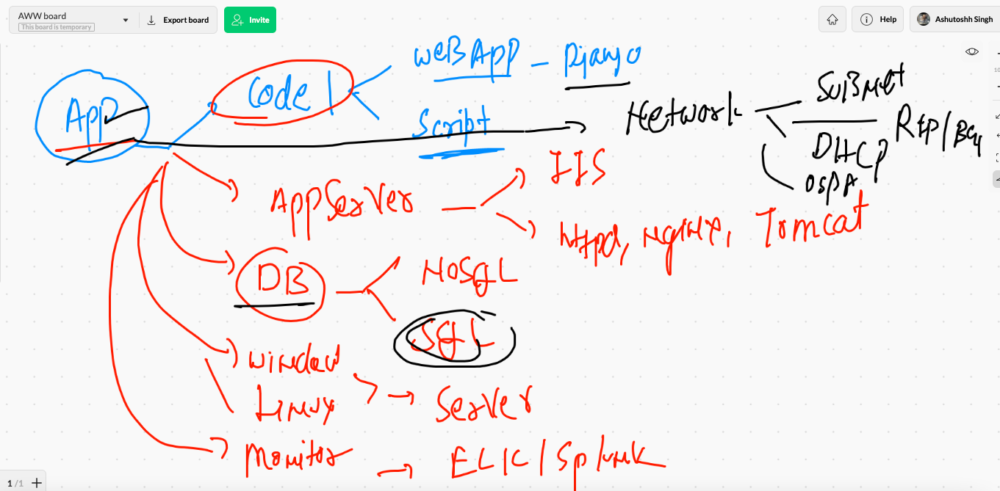
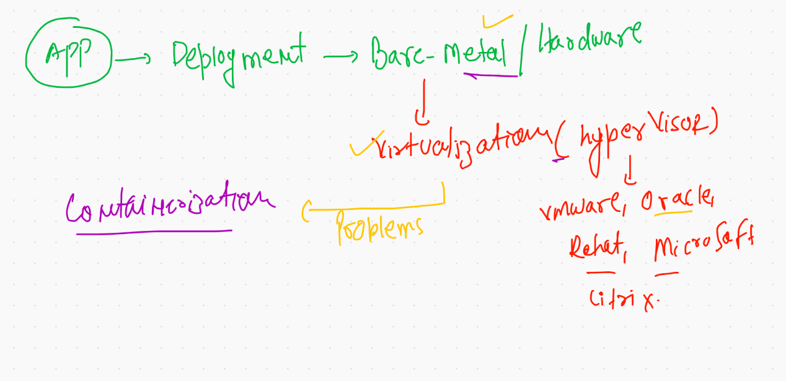
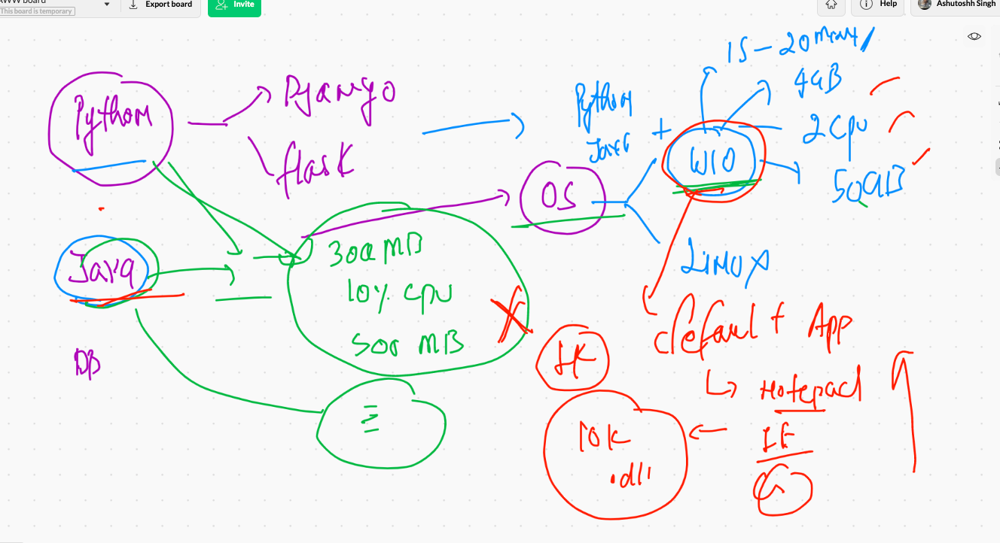
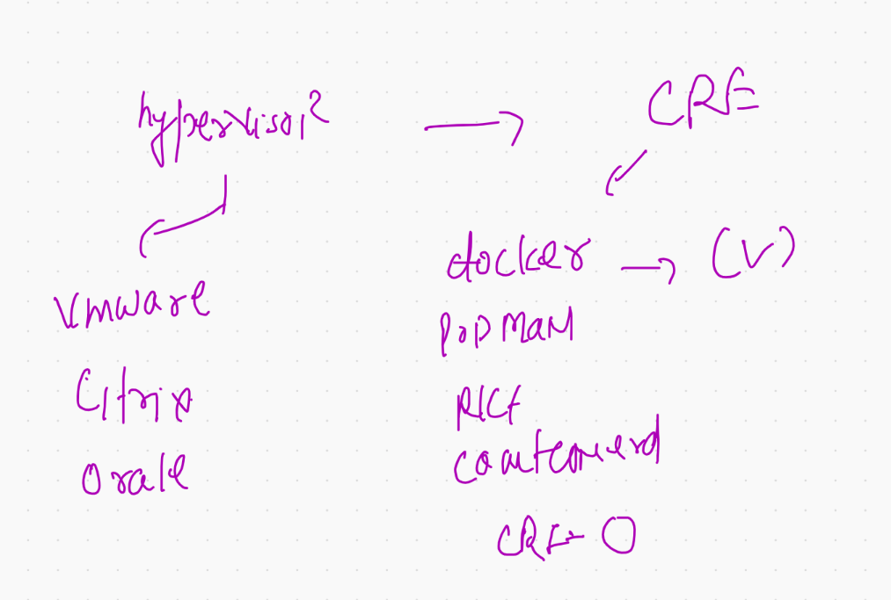
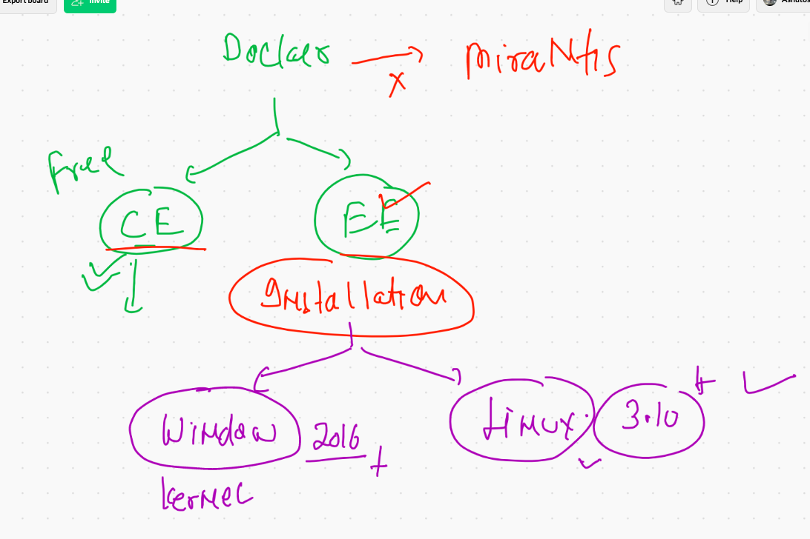
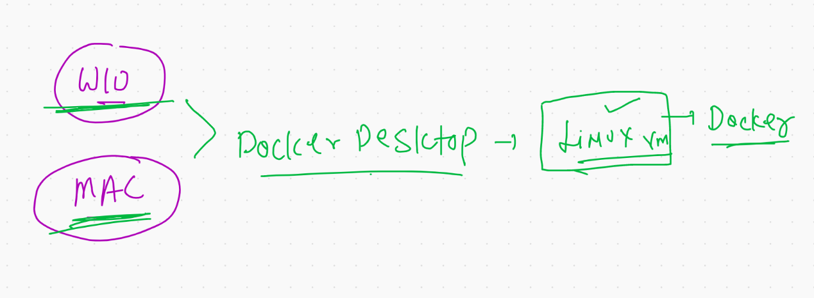
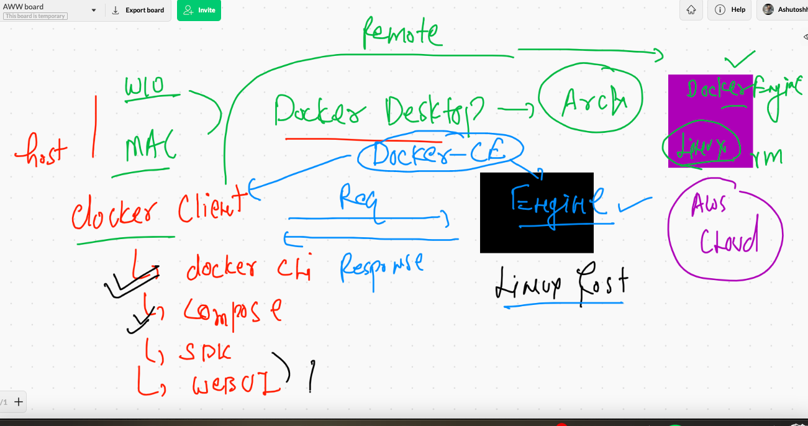
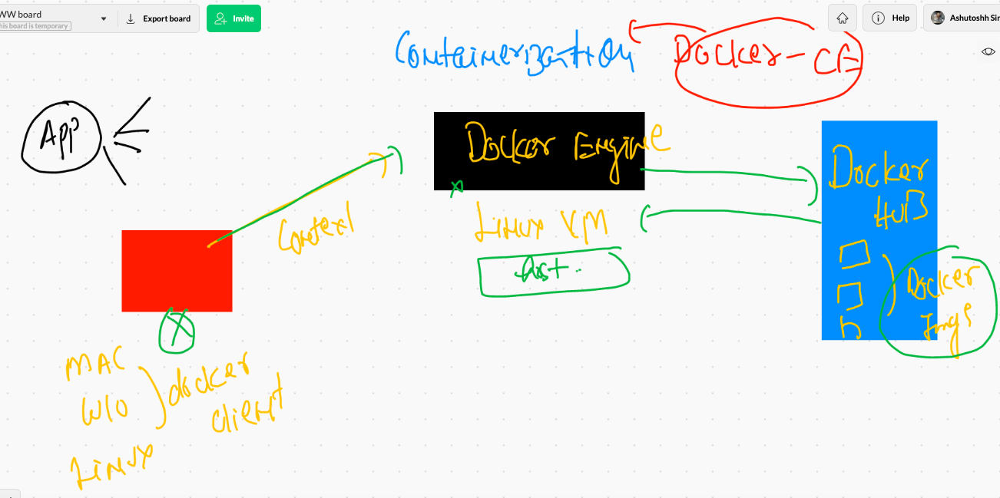
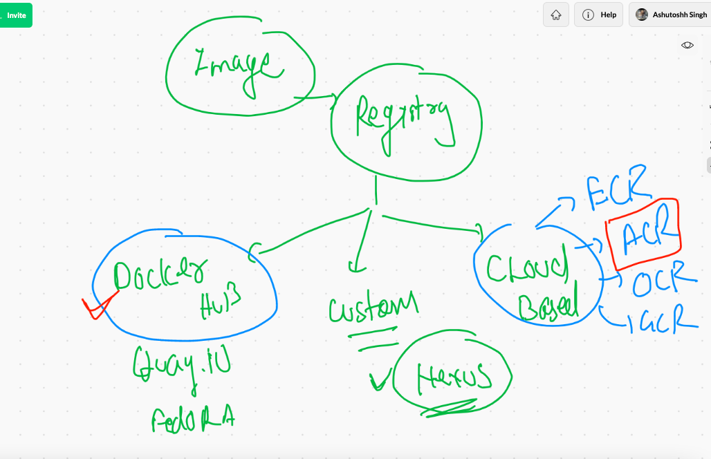

# Intro to app 




## app deploy history 



## hypervisor based OS problems 



## list of CRE 



## Introduction to Docker 



## DOcker Desktop introduction 



## Docker  architecture 



## checking docker client side 

```
❯ docker  version
Client:
 Cloud integration: 1.0.14
 Version:           20.10.6
 API version:       1.41
 Go version:        go1.16.3
 Git commit:        370c289
 Built:             Fri Apr  9 22:46:57 2021
 OS/Arch:           darwin/amd64
 Context:           default
 Experimental:      true

Server: Docker Engine - Community
 Engine:
  Version:          20.10.6
  API version:      1.41 (minimum version 1.12)
  Go version:       go1.13.15


```


## Installing docker Ce --Engine on Linux 

[EngineDOcker](https://docs.docker.com/engine/install/)

### Installing in Linux vm (amazon linux)

```
[root@ip-172-31-47-111 ~]# yum  install  docker  -y
Failed to set locale, defaulting to C
Loaded plugins: extras_suggestions, langpacks, priorities, update-motd
amzn2-core                                                                                | 3.7 kB  00:00:00     
Resolving Dependencies
--> Running transaction check
---> Package docker.x86_64 0:20.10.4-1.amzn2 will be installed
--> Processing Dependency: runc >= 1.0.0 for package: docker-20.10.4-1.amzn2.x86_64
--> Processing Dependency: lib

```

## COnfiguring user on docker engine 

```
[root@ip-172-31-47-111 ~]# usermod  -aG  docker  test 
[root@ip-172-31-47-111 ~]# 
[root@ip-172-31-47-111 ~]# 
[root@ip-172-31-47-111 ~]# systemctl start  docker 
[root@ip-172-31-47-111 ~]# systemctl enable   docker 
Created symlink from /etc/systemd/system/multi-user.target.wants/docker.service to /usr/lib/systemd/system/docker.service.
[root@ip-172-31-47-111 ~]# systemctl status  docker 
● docker.service - Docker Application Container Engine
   Loaded: loaded (/usr/lib/systemd/system/docker.service; enabled; vendor preset: disabled)
   Active: active (running) since Mon 2021-05-31 06:15:28 UTC; 10s ago
     Docs: https://docs.docker.com
 Main PID: 3725 (dockerd)
   CGroup: /system.slice/docker.service
           └─3725 /usr/bin/dockerd -H fd:// --containerd=/run/containerd/containerd.sock --default-ulimit nofile=1024:4096

May 31 06:15:27 ip-172-31-47-111.ec2.internal dockerd[3725]: time="2021-05-31T06:15:27.561750924Z" level=info msg="scheme...grpc
May 31 06:15:27 ip-172-31-47-111.ec2.internal dockerd[3725]: time="2021-05-31T06:15:27.561765235Z" level=info msg="ccReso...grpc
May 31 06:15:27 ip-172-31-47-111.ec2.internal dockerd[3725]: time="2021-05-31T06:15:27.561772885Z" level=info msg="Client...grpc
May 31 06:15:27 ip-172-31-47-111.ec2.internal dockerd[3725]: time="2021-05-31T06:15:27.630077738Z" level=info msg="Loadin...rt."
May 31 06:15:27 ip-172-31-47-111.ec2.internal dockerd[3725]: time="2021-05-31T06:15:27.885151055Z" level=info msg="Defaul...ess"
May 31 06:15:28 ip-172-31-47-111.ec2.internal dockerd[3725]: time="2021-05-31T06:15:28.062152573Z" level=info msg="Loadin...ne."
May 31 06:15:28 ip-172-31-47-111.ec2.internal dockerd[3725]: time="2021-05-31T06:15:28.166060958Z" level=info msg="Docker...10.4
May 31 06:15:28 ip-172-31-47-111.ec2.internal dockerd[3725]: time="2021-05-31T06:15:28.166836232Z" level=info msg="Daemon...ion"
May 31 06:15:28 ip-172-31-47-111.ec2.internal systemd[1]: Started Docker Application Container Engine.
May 31 06:15:28 ip-172-31-47-111.ec2.internal dockerd[3725]: time="2021-05-31T06:15:28.188688545Z" level=info msg="API li...ock"
Hint: Some lines were ellipsized, use -l to show in full.


```


## Now time for connecting Docker client to Docker engine using secure ssh keybased connection 

### Mac client generating key pair 

```
❯ ssh-keygen
Generating public/private rsa key pair.
Enter file in which to save the key (/Users/fire/.ssh/id_rsa): 
/Users/fire/.ssh/id_rsa already exists.
Overwrite (y/n)? y
Enter passphrase (empty for no passphrase): 
Enter same passphrase again: 
Your identification has been saved in /Users/fire/.ssh/id_rsa.
Your public key has been saved in /Users/fire/.ssh/id_rsa.pub.
The key fingerprint is:
SHA256:hdIEmN/LOiYFsXFB3gL6AxJyB1yTBXJRTenMqkqglhY fire@ashutoshhs-MacBook-Air.local
The key's randomart image is:
+---[RSA 3072]----+
|o.+oOX*=o.       |
|.o.=*+.+o.       |
|. o  *+=+ .      |
| . oo .o=.       |
|.E  o. oS.       |
|..o  .o o        |
|.+.  o .         |
|o.  o +          |
|  .. o .         |
+----[SHA256]-----+

```

### same method in windows 10 using gitbash 

### Sending public key to test user in remote linux 

```
 ssh-copy-id   test@54.224.54.156
/usr/bin/ssh-copy-id: INFO: Source of key(s) to be installed: "/Users/fire/.ssh/id_rsa.pub"
/usr/bin/ssh-copy-id: INFO: attempting to log in with the new key(s), to filter out any that are already installed
/usr/bin/ssh-copy-id: INFO: 1 key(s) remain to be installed -- if you are prompted now it is to install the new keys
test@54.224.54.156's password: 
/etc/profile.d/lang.sh: line 19: warning: setlocale: LC_CTYPE: cannot change locale (UTF-8): No such file or directory

Number of key(s) added:        1

Now try logging into the machine, with:   "ssh 'test@54.224.54.156'"
and check to make sure that only the key(s) you wanted were added.


```

## Now testing password less connection from client machine 

```
❯ ssh  test@54.224.54.156
Last login: Mon May 31 05:57:21 2021 from 103.133.168.14

       __|  __|_  )
       _|  (     /   Amazon Linux 2 AMI
      ___|\___|___|

https://aws.amazon.com/amazon-linux-2/
-bash: warning: setlocale: LC_CTYPE: cannot change locale (UTF-8): No such file or directory
[test@ip-172-31-47-111 ~]$ 
[test@ip-172-31-47-111 ~]$ 
[test@ip-172-31-47-111 ~]$ exit
logout
Connection to 54.224.54.156 closed.

```

### creating context for remote docker engine 

```
❯ docker  context   ls
NAME                TYPE                DESCRIPTION                               DOCKER ENDPOINT               KUBERNETES ENDPOINT                         ORCHESTRATOR
default *           moby                Current DOCKER_HOST based configuration   unix:///var/run/docker.sock   https://3.230.225.157:6443 (ashuproject1)   swarm
❯ 
❯ docker  context  create  JciRDE   --docker  host="ssh://test@54.224.54.156"
JciRDE
Successfully created context "JciRDE"
❯ docker  context   ls
NAME                TYPE                DESCRIPTION                               DOCKER ENDPOINT               KUBERNETES ENDPOINT                         ORCHESTRATOR
JciRDE              moby                                                          ssh://test@54.224.54.156                                                  
default *           moby                Current DOCKER_HOST based configuration   unix:///var/run/docker.sock   https://3.230.225.157:6443 (ashuproject1)   swarm


```

### Switching to REmote docker engine 

```
❯ docker  context   use  JciRDE
JciRDE
❯ docker  context   ls
NAME                TYPE                DESCRIPTION                               DOCKER ENDPOINT               KUBERNETES ENDPOINT                         ORCHESTRATOR
JciRDE *            moby                                                          ssh://test@34.237.219.131                                                 
default             moby                Current DOCKER_HOST based configuration   unix:///var/run/docker.sock   https://3.230.225.157:6443 (ashuproject1)   swarm


```

### creating tcp based context. 

```
10051  docker  context create   newjci  --docker  host="tcp://34.237.219.131:2375"
10052  docker  context  use  newjci  
10053  docker  context  ls
10054  docker  version 

```

## FInal overview of docker ce 




## Docker operations 

### images  checking 

```
❯ docker  images
REPOSITORY   TAG       IMAGE ID   CREATED   SIZE

```


### searching images on docker hub 

```
❯ docker  search   python
NAME                             DESCRIPTION                                     STARS     OFFICIAL   AUTOMATED
python                           Python is an interpreted, interactive, objec…   6190      [OK]       
django                           Django is a free web application framework, …   1077      [OK]       
pypy                             PyPy is a fast, compliant alternative implem…   275       [OK]       
nikolaik/python-nodejs           Python with Node.js                             74                   [OK]
joyzoursky/python-chromedriver   Python with Chromedriver, for running automa…   58                   [OK]
arm32v7/python                   Python is an interpreted, interactive, objec…   57                   
circleci/python                  Python is an interpreted, interactive, objec…   43                   
centos/python-35-centos7         Platform for building and running Python 3.5…   39                   
hylang                           Hy is a Lisp dialect that translates express…   32        [OK]       
centos/python-36-centos7    

```

### Downloading docker images

```
❯ docker  pull  centos
Using default tag: latest
latest: Pulling from library/centos
7a0437f04f83: Pull complete 
Digest: sha256:5528e8b1b1719d34604c87e11dcd1c0a20bedf46e83b5632cdeac91b8c04efc1
Status: Downloaded newer image for centos:latest
docker.io/library/centos:latest
❯ docker  images
REPOSITORY   TAG       IMAGE ID       CREATED        SIZE
python       latest    5b3b4504ff1f   6 days ago     886MB
ubuntu       18.04     81bcf752ac3d   11 days ago    63.1MB
centos       latest    300e315adb2f   5 months ago   209MB

```

## Docker images registry options 



## creating first container with ping process

```
❯ docker  run  --name  ashuc1    alpine:latest   ping  127.0.0.1
PING 127.0.0.1 (127.0.0.1): 56 data bytes
64 bytes from 127.0.0.1: seq=0 ttl=255 time=0.033 ms
64 bytes from 127.0.0.1: seq=1 ttl=255 time=0.040 ms
64 bytes from 127.0.0.1: seq=2 ttl=255 time=0.073 ms
64 bytes from 127.0.0.1: seq=3 ttl=255 time=0.048 ms
64 bytes from 127.0.0.1: seq=4 ttl=255 time=0.042 ms
64 bytes from 127.0.0.1: seq=5 ttl=255 time=0.051 ms
64 bytes from 127.0.0.1: seq=6 ttl=255 time=0.047 ms
64 bytes from 127.0.0.1: seq=7 ttl=255 time=0.046 ms
64 bytes from 127.0.0.1: seq=8 ttl=255 time=0.043 ms
64 bytes from 127.0.0.1: seq=9 ttl=255 time=0.044 ms
^C
--- 127.0.0.1 ping statistics ---
10 packets transmitted, 10 packets received, 0% packet loss
round-trip min/avg/max = 0.033/0.046/0.073 ms

```

### list of running containers 

```
❯ docker  ps
CONTAINER ID   IMAGE           COMMAND            CREATED              STATUS              PORTS     NAMES
30b58fd66f7c   alpine:latest   "ping 127.0.0.1"   55 seconds ago       Up 51 seconds                 shalomc1
27c36187e516   alpine:latest   "ping 127.0.0.1"   About a minute ago   Up About a minute             sumitc1
f47d536de69c   ubuntu:18.04    "/bin/bash"        18 minutes ago       Up 8 minutes                  boorish_grommet


```

### checking output of a running container 

```
❯ docker  logs   ashuc2
PING fb.com (157.240.229.35): 56 data bytes
64 bytes from 157.240.229.35: seq=0 ttl=48 time=1.805 ms
64 bytes from 157.240.229.35: seq=1 ttl=48 time=1.154 ms
64 bytes from 157.240.229.35: seq=2 ttl=48 time=1.155 ms
64 bytes from 157.240.229.35: seq=3 ttl=48 time=1.298 ms
64 bytes from 157.240.229.35: seq=4 ttl=48 time=1.195 ms
64 bytes from 157.240.229.35: seq=5 ttl=48 time=1.188 ms
64 bytes from 157.240.229.35: seq=6 ttl=48 time=1.167 ms
64 bytes from 157.240.229.35: seq=7 ttl=48 time=1.173 ms
64 bytes from 157.240.229.35: seq=8 ttl=48 time=1.164 ms
64 bytes from 157.240.229.35: seq=9 ttl=

```

### stopping a running container 

```
❯ docker  stop  ashuc2
ashuc2

```

### starting a stopped container 

```
 docker  start  ashuc2
```

## starting a child process in a running container 

```
❯ docker  exec  -d  ashuc2  ping google.com
❯ docker  top  ashuc2
UID                 PID                 PPID                C                   STIME               TTY                 TIME                CMD
root                18458               18423               0                   07:22               ?                   00:00:00            ping fb.com
root                31064               18423               1                   07:25               ?                   00:00:00            ping google.com

```

## COntainer understanding more deeploy 

### it has its own file system 

```
❯ docker  exec   -i -t  ashuc2   sh
/ # 
/ # ls  /
bin    dev    etc    home   lib    media  mnt    opt    proc   root   run    sbin   srv    sys    tmp    usr    var
/ # 

```

### it has its own process

```
/ # ps  -e
PID   USER     TIME  COMMAND
    1 root      0:00 ping fb.com
    8 root      0:00 ping google.com
   14 root      0:00 sh
   21 root      0:00 ps -e
   
 ```
 
 ### each container will have its own IP 
 
 ```
 / # ifconfig 
eth0      Link encap:Ethernet  HWaddr 02:42:AC:11:00:06  
          inet addr:172.17.0.6  Bcast:172.17.255.255  Mask:255.255.0.0
          UP BROADCAST RUNNING MULTICAST  MTU:1500  Metric:1
          RX packets:1085 errors:0 dropped:0 overruns:0 frame:0
          TX packets:1067 errors:0 dropped:0 overruns:0 carrier:0
          collisions:0 txqueuelen:0 
          RX bytes:103426 (101.0 KiB)  TX bytes:102374 (99.9 KiB)

lo        Link encap:Local Loopback  
          inet addr:127.0.0.1  Mask:255.0.0.0
          UP LOOPBACK RUNNING  MTU:65536  Metric:1
          RX packets:0 errors:0 dropped:0 overruns:0 frame:0
          TX packets:0 errors:0 dropped:0 overruns:0 carrier:0
          collisions:0 txqueuelen:1000 
          RX bytes:0 (0.0 B)  TX bytes:0 (0.0 B)


```

### history 

```
❯ docker  exec   -i -t  ashuc2   sh
/ # 
/ # ls  /
bin    dev    etc    home   lib    media  mnt    opt    proc   root   run    sbin   srv    sys    tmp    usr    var
/ # ps  -e
PID   USER     TIME  COMMAND
    1 root      0:00 ping fb.com
    8 root      0:00 ping google.com
   14 root      0:00 sh
   21 root      0:00 ps -e
/ # ifconfig 
eth0      Link encap:Ethernet  HWaddr 02:42:AC:11:00:06  
          inet addr:172.17.0.6  Bcast:172.17.255.255  Mask:255.255.0.0
          UP BROADCAST RUNNING MULTICAST  MTU:1500  Metric:1
          RX packets:1085 errors:0 dropped:0 overruns:0 frame:0
          TX packets:1067 errors:0 dropped:0 overruns:0 carrier:0
          collisions:0 txqueuelen:0 
          RX bytes:103426 (101.0 KiB)  TX bytes:102374 (99.9 KiB)

lo        Link encap:Local Loopback  
          inet addr:127.0.0.1  Mask:255.0.0.0
          UP LOOPBACK RUNNING  MTU:65536  Metric:1
          RX packets:0 errors:0 dropped:0 overruns:0 frame:0
          TX packets:0 errors:0 dropped:0 overruns:0 carrier:0
          collisions:0 txqueuelen:1000 
          RX bytes:0 (0.0 B)  TX bytes:0 (0.0 B)

/ # exit


```


