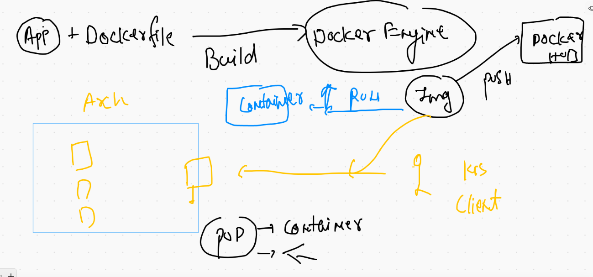
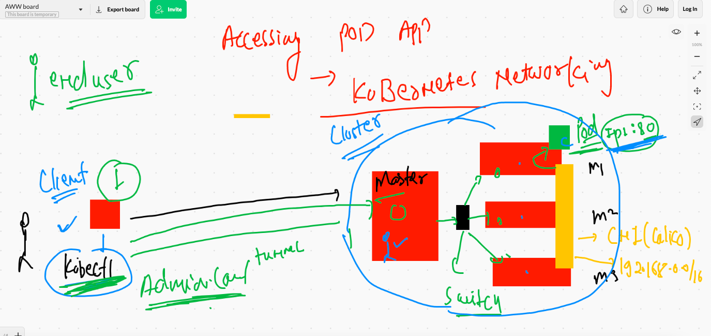
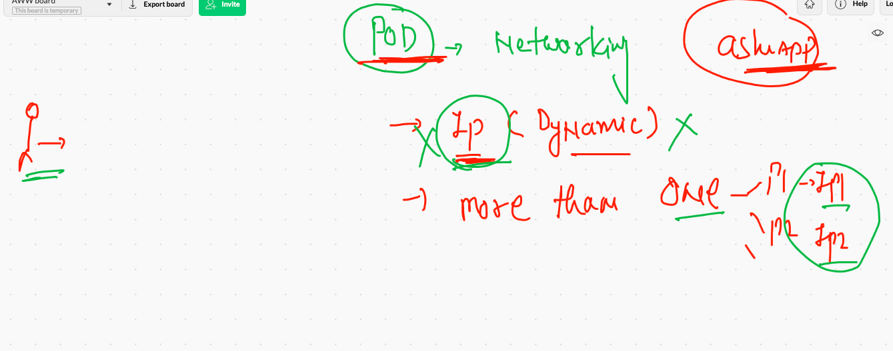
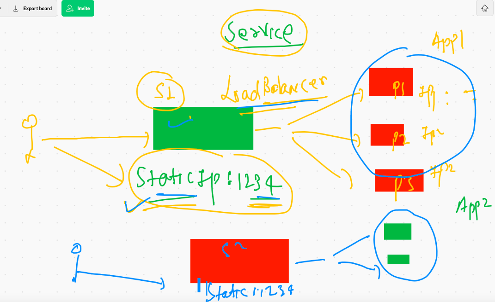
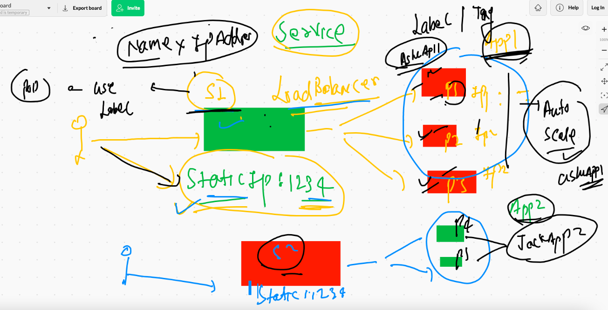
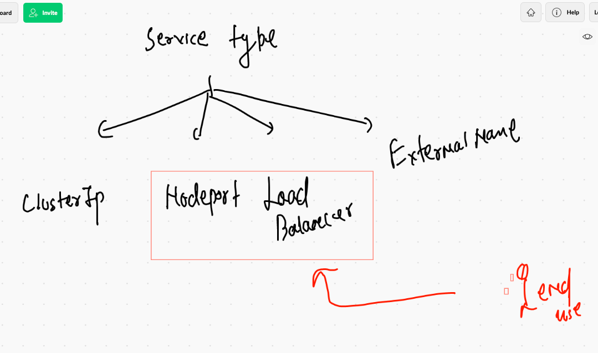
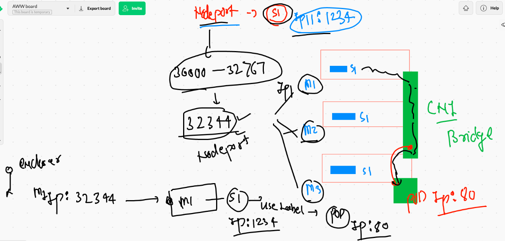

# summary 



## Deploy pod with dry-run checks

```
❯ cd pods
❯ ls
ashupod1.yaml
❯ kubectl  apply -f  ashupod1.yaml  --dry-run=client
pod/ashupod-123 created (dry run)
❯ kubectl  apply -f  ashupod1.yaml  --dry-run
W0602 09:35:17.589177    5329 helpers.go:557] --dry-run is deprecated and can be replaced with --dry-run=client.
pod/ashupod-123 created (dry run)

```

## Deploy pod 

```
❯ kubectl  apply -f  ashupod1.yaml
pod/ashupod-123 created
❯ kubectl  get  pods
NAME          READY   STATUS    RESTARTS   AGE
ashupod-123   1/1     Running   0          11s

```

## checking more details about pod 

```
❯ kubectl  get  po  ashupod-123  -o wide
NAME          READY   STATUS    RESTARTS   AGE   IP                NODE                           NOMINATED NODE   READINESS GATES
ashupod-123   1/1     Running   0          14m   192.168.252.130   ip-172-31-37-20.ec2.internal   <none>           <none>
❯ kubectl  get  nodes
NAME                            STATUS   ROLES                  AGE   VERSION
ip-172-31-34-76.ec2.internal    Ready    <none>                 18h   v1.21.1
ip-172-31-37-20.ec2.internal    Ready    <none>                 18h   v1.21.1
ip-172-31-41-131.ec2.internal   Ready    <none>                 18h   v1.21.1


```

## all pods

```
❯ kubectl  get  po -o wide
NAME              READY   STATUS    RESTARTS   AGE     IP                NODE                            NOMINATED NODE   READINESS GATES
ashupod-123       1/1     Running   0          15m     192.168.252.130   ip-172-31-37-20.ec2.internal    <none>           <none>
asifpod-httpd1    1/1     Running   0          98s     192.168.250.135   ip-172-31-34-76.ec2.internal    <none>           <none>
checkpod-1        1/1     Running   0          9m45s   192.168.249.68    ip-172-31-41-131.ec2.internal   <none>           <none>
harendra-123      1/1     Running   0          15m     192.168.252.135   ip-172-31-37-20.ec2.internal    <none>           <none>
kiran-testpod     1/1     Running   0          10m     192.168.252.138   ip-172-31-37-20.ec2.internal    <none>           <none>
nirupod           1/1     Running   0          15m     192.168.252.134   ip-172-31-37-20.ec2.internal    <none>           <none>
prachipod-1       1/1     Running   0          15m     192.168.252.133   ip-172-31-37-20.ec2.internal    <none>           <none>
prashant-123      1/1     Running   0          15m     192.168.252.132   ip-172-31-37-20.ec2.internal    <none>           <none>
priyankapod-123   1/1     Running   0          15m     192.168.250.1

```

## Describe POd 

```
❯ kubectl  describe  pod ashupod-123
Name:         ashupod-123
Namespace:    default
Priority:     0
Node:         ip-172-31-37-20.ec2.internal/172.31.37.20
Start Time:   Wed, 02 Jun 2021 09:36:08 +0530
Labels:       <none>
Annotations:  cni.projectcalico.org/podIP: 192.168.252.130/32
              cni.projectcalico.org/podIPs: 192.168.252.130/32
Status:       Running
IP:           192.168.252.130
IPs:
  IP:  192.168.252.130
Containers:
  ashuc1:
    Container ID:   docker://25d6e750751f9c1c518dc52d14959e8f6bbe63de7c162ae819f1531e25425979
    Image:          dockerashu/httpd:JCIashuv1
    Image ID:       docker-pullable://dockerashu/httpd@sha256:d5cfa9531cc47135d487333db627a9605f1b7be436a0e09dd2e77562a25b8827
    Port:           80/TCP

```

## Login in a container running inside POd 

```
❯ kubectl  exec  -it  ashupod-123   -- bash
[root@ashupod-123 /]# 
[root@ashupod-123 /]# 
[root@ashupod-123 /]# 
[root@ashupod-123 /]# cat  /etc/os-release 
NAME=Fedora
VERSION="34 (Container Image)"
ID=fedora
VERSION_ID=34
VERSION_CODENAME=""
PLATFORM_ID="platform:f34"
PRETTY_NAME="Fedora 34 (Container Image)"
ANSI_COLOR="0;38;2;60;110;180"
LOGO=fedora-logo-icon
CPE_NAME="cpe:/o:fedoraproject:fedora:34"
HOME_URL="https://fedoraproject.org/"
DOCUMENTATION_URL="https://docs.fedoraproject.org/en-US/fedora/34/system-administrators-guide/"
SUPPORT_URL="https://fedoraproject.org/wiki/Communicating_and_getting_help"
BUG_REPORT_URL="https://bugzilla.redhat.com/"
REDHAT_BUGZILLA_PRODUCT="Fedora"
REDHAT_BUGZILLA_PRODUCT_VERSION=34
REDHAT_SUPPORT_PRODUCT="Fedora"
REDHAT_SUPPORT_PRODUCT_VERSION=34
PRIVACY_POLICY_URL="https://fedoraproject.org/wiki/Legal:PrivacyPolicy"
VARIANT="Container Image"
VARIANT_ID=container
[root@ashupod-123 /]# cd  /var/www/html/
[root@ashupod-123 html]# ls
images  index.html  styles
[root@ashupod-123 html]# uname -r
4.14.232-176.381.amzn2.x86_64


```

## checking pod - container parent process logs 

```
kubectl  logs   ashupod-123
AH00558: httpd: Could not reliably determine the server's fully qualified domain name, using 192.168.252.130. Set the 'ServerName' directive globally to suppress this message

```

## Deleting pods 

```
 kubectl  delete  pod  ashupod-123
pod "ashupod-123" deleted

```
## pod command history 

```
023  kubectl  get  po 
10024  kubectl  get  po   |  wc -l
10025  kubectl  get  po 
10026  kubectl  get  po  ashupod-123  -o wide
10027  kubectl  get  nodes
10028  history
10029  kubectl  get  po -o wide
10030  kubectl  get  nodes
10031  history
10032  kubectl  describe  pod ashupod-123 
10033  history
10034  kubectl  exec  -it  ashupod-123   -- bash 
10035  h
10036  history
10037  kubectl  logs   ashupod-123 
10038  kubectl  logs  -f  ashupod-123 
10039  history
10040  kubectl  get  po 
10041  kubectl  delete  pod  ashupod-123 

```
## Deleting all the pods

```
 kubectl  delete pods --all
pod "ashupod2" deleted
pod "asifpod-httpd1" deleted
pod "checkpod-1" deleted
pod "harendra-123" deleted
pod "kiran-testpod" deleted
pod "prachipod" deleted

```

### YAML generation 

```
8  kubectl  run  ashupod2  --image=dockerashu/httpd:JCIashuv1  --port=80 --restart=Never   --dry-run=client 
10049  kubectl  run  ashupod2  --image=dockerashu/httpd:JCIashuv1  --port=80  --dry-run=client  -o yaml 
10050  history
10051  kubectl  run  ashupod2  --image=dockerashu/httpd:JCIashuv1  --port=80  --dry-run=client  -o yaml 
10052  ls
10053  kubectl  run  ashupod2  --image=dockerashu/httpd:JCIashuv1  --port=80  --dry-run=client  -o yaml   >mypod.yml
10054  ls
10055  kubectl  run  ashupod2  --image=dockerashu/httpd:JCIashuv1  --port=80 

```

## Deployment of POD 

```
❯ ls
ashupod1.yaml autopod.yaml  mypod.yml
❯ kubectl  apply -f  autopod.yaml
pod/ashupod2 created
❯ kubectl  get  po
NAME       READY   STATUS    RESTARTS   AGE
ashupod2   1/1     Running   0          9s
❯ kubectl  get  po -o wide
NAME       READY   STATUS    RESTARTS   AGE   IP                NODE                           NOMINATED NODE   READINESS GATES
ashupod2   1/1     Running   0          16s   192.168.252.144   ip-172-31-37-20.ec2.internal   <none>           <none>
❯ kubectl  get  no
NAME                            STATUS   ROLES                  AGE   VERSION
ip-172-31-34-76.ec2.internal    Ready    <none>                 19h   v1.21.1
ip-172-31-37-20.ec2.internal    Ready    <none>                 19h   v1.21.1
ip-172-31-41-131.ec2.internal   Ready    <none>                 19h   v1.21.1
ip-172-31-41-71.ec2.internal    Ready    control-plane,master   19h   v1.21.1

```

## JSOn generate 

```
  kubectl  run  ashupod2  --image=dockerashu/httpd:JCIashuv1  --port=80  --dry-run=client -o json 
10068  kubectl  run  ashupod2  --image=dockerashu/httpd:JCIashuv1  --port=80  --dry-run=client -o json   >aa.json 

```

## accessing POd application 



## making a tunnel b/w client and cluster 

```
❯ kubectl  port-forward  ashupod2   1233:80
Forwarding from 127.0.0.1:1233 -> 80
Forwarding from [::1]:1233 -> 80
Handling connection for 1233
Handling connection for 1233

```

## POd related network problems 



## Introduction to service in k8s



## Service use labels of POd to find out 




## type of service 




## label of pods 

```
❯ kubectl apply -f  ashupod1.yaml
pod/ashupod-123 created
❯ kubectl  get  po  ashupod-123  --show-labels
NAME          READY   STATUS    RESTARTS   AGE   LABELS
ashupod-123   1/1     Running   0          11s   <none>
❯ kubectl  get  po   --show-labels
NAME              READY   STATUS    RESTARTS   AGE     LABELS
ashupod-123       1/1     Running   0          2m13s   <none>
ashupod2          1/1     Running   0          36m     run=ashupod2
checkpod-1        1/1     Running   0          32m     <none>
harendra-123      1/1     Running   0          25m     <none>
kiran-testpod     1/1     Running   0          23m     <none>
nirupod           1/1     Running   0          35m     <none>
prachipod-2       1/1     Running   0          35m     run=prachipod-2
prashantautopod   1/1     Running   0          33m     run=prashantautopod

```

## updating label 

```
❯ kubectl  get  po  ashupod-123  --show-labels
NAME          READY   STATUS    RESTARTS   AGE     LABELS
ashupod-123   1/1     Running   0          3m53s   <none>
❯ kubectl  apply  -f  ashupod1.yaml
pod/ashupod-123 configured
❯ kubectl  get  po  ashupod-123  --show-labels
NAME          READY   STATUS    RESTARTS   AGE    LABELS
ashupod-123   1/1     Running   0          4m7s   x=helloashu1


```

## nodeport service 

```
❯ kubectl   create   service  nodeport  ashusvc1   --tcp  1234:80  --dry-run=client -o yaml
apiVersion: v1
kind: Service
metadata:
  creationTimestamp: null
  labels:
    app: ashusvc1
  name: ashusvc1
spec:
  ports:
  - name: 1234-80
    port: 1234
    protocol: TCP
    targetPort: 80
  selector:
    app: ashusvc1
  type: NodePort
status:
  loadBalancer: {}
❯ kubectl   create   service  nodeport  ashusvc1   --tcp  1234:80  --dry-run=client -o yaml  >svc1.yaml

```
## Nodeport understanding 



## Troubleshooting svc to pod communication 

```
❯ kubectl  get  po  rajkiran123 --show-labels
NAME          READY   STATUS    RESTARTS   AGE   LABELS
rajkiran123   1/1     Running   0          70m   x=rajkiran789
❯ 
❯ kubectl  get  svc  rajkirans1 -o wide
NAME         TYPE       CLUSTER-IP     EXTERNAL-IP   PORT(S)          AGE   SELECTOR
rajkirans1   NodePort   10.107.96.20   <none>        2021:32584/TCP   59m   app=rajkirans1,x=rajkiran789


```

## Delete all api-resources 

```
❯ kubectl  delete all --all
pod "ashupod-123" deleted
pod "ashupod2" deleted
pod "asifpod-httpd1" deleted
pod "checkpod-1" deleted
pod "harendra-123" deleted
pod "kiran-testpod" deleted
pod "nirupod" deleted
pod "prachipod-2" deleted
pod "prashantautopod" deleted
pod "priyankapod-123" deleted
pod "priyankapod-2" deleted
pod "rajeshpod-day2" deleted
pod "rajkiran123" deleted
pod "sagarpod-123" deleted
pod "saket2" deleted
pod "shalompod-1" deleted
pod "sumitpod-123" deleted
pod "sumitpod2" deleted
pod "tapender2" deleted
pod "tarun-123" deleted
pod "vipinpod1" deleted
service "ashusvc1" deleted
service "asifsvc1" deleted
service "checksrvicenodeport" deleted
service "harendrasvc1" deleted
service "helloappsvc" deleted

```

## creating multi app docker images 

```

docker  build  -t   dockerashu/httpd:jcimultiappv1 -f  multiapp.dockerfile  .
[+] Building 88.9s (13/13) FINISHED                                                                                          
 => [internal] load build definition from multiapp.dockerfile                                                           0.1s
 => => transferring dockerfile: 513B                                                                                    0.1s
 => [internal] load .dockerignore                                                                                       0.1s
 => => transferring context: 159B                                      
 
 ```
 
 

