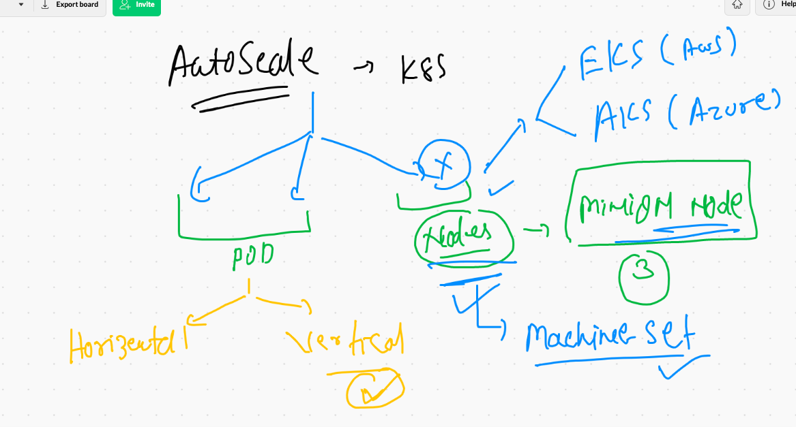
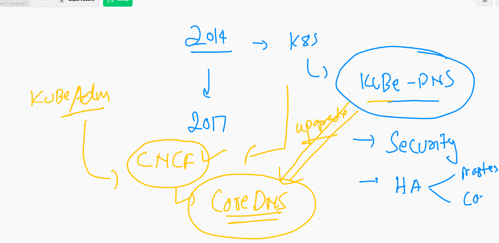

# Journey 


## Introduction to microservices 


## Certification info 


## Kubernetes service account 


# RBAC 


## Dashboard --

###  default there is no permission in serviceaccount 

```
❯ kubectl  get  po -n kubernetes-dashboard
NAME                                         READY   STATUS    RESTARTS   AGE
dashboard-metrics-scraper-856586f554-dccwc   1/1     Running   1          17h
kubernetes-dashboard-78c79f97b4-ftx4q        1/1     Running   1          17h
❯ kubectl  get  svc -n kubernetes-dashboard
NAME                        TYPE        CLUSTER-IP      EXTERNAL-IP   PORT(S)         AGE
dashboard-metrics-scraper   ClusterIP   10.107.214.55   <none>        8000/TCP        17h
kubernetes-dashboard        NodePort    10.108.33.170   <none>        443:31336/TCP   17h
❯ kubectl  get  sa  -n kubernetes-dashboard
NAME                   SECRETS   AGE
default                1         17h
kubernetes-dashboard   1         17h
❯ kubectl  get  clusterrole   |   grep -i  admin
admin                                                                  2021-06-01T09:41:04Z
cluster-admin                                                          2021-06-01T09:41:04Z
system:aggregate-to-admin                                              2021-06-01T09:41:04Z
system:kubelet-api-admin                                               2021-06-01T09:41:04Z


```

## to access dashboard getting token of serviceaccount 

```
❯ kubectl  get  sa  -n kubernetes-dashboard
NAME                   SECRETS   AGE
default                1         17h
kubernetes-dashboard   1         17h
❯ kubectl  get  secret   -n kubernetes-dashboard
NAME                               TYPE                                  DATA   AGE
default-token-6sdnw                kubernetes.io/service-account-token   3      17h
kubernetes-dashboard-certs         Opaque                                0      17h
kubernetes-dashboard-csrf          Opaque                                1      17h
kubernetes-dashboard-key-holder    Opaque                                2      17h
kubernetes-dashboard-token-kmd4f   kubernetes.io/service-account-token   3      17h

===

```

## getting secret 

```
10105  kubectl  describe  secret   kubernetes-dashboard-token-kmd4f   -n kubernetes-dashboard 
10106  kubectl  get  secret/kubernetes-dashboard-token-kmd4f -o jsonpath='{.data.token}'    -n kubernetes-dashboard 

10109  kubectl  get  secret/kubernetes-dashboard-token-kmd4f -o jsonpath='{.data.token}'    -n kubernetes-dashboard |  base64 -d
❯ kubectl  describe  secret   kubernetes-dashboard-token-kmd4f   -n kubernetes-dashboard
Name:         kubernetes-dashboard-token-kmd4f
Namespace:    kubernetes-dashboard
Labels:       <none>
Annotations:  kubernetes.io/service-account.name: kubernetes-dashboard
              kubernetes.io/service-account.uid: 6b5c1177-b2b9-4f57-a461-089f46e7b5ae

Type:  kubernetes.io/service-account-token

Data
====
token:      eyJhbGciOiJSUzI1NiIsImtpZCI6Ilg0ZXRFdVRxQ1VXajFQZDV3UlVYdk91VnNDWlVqLVBtVk0xQ2pHd3BfbG8ifQ.eyJpc3MiOiJrdWJlcm5ldGVzL3NlcnZpY2VhY2NvdW50Iiwia3ViZXJuZXRlcy5pby9zZXJ2aWNlYWNjb3VudC9uYW1lc3BhY2UiOiJrdWJlcm5ldGVzLWRhc2hib2FyZCIsImt1YmVybmV0ZXMuaW8vc2VydmljZWFjY291bnQvc2VjcmV0Lm5hbWUiOiJrdWJlcm5ldGVzLWRhc2hib2FyZC10b2tlbi1rbWQ0ZiIsImt1YmVybmV0ZXMuaW8vc2VydmljZWFjY291bnQvc2VydmljZS1hY2NvdW50Lm5hbWUiOiJrdWJlcm5ldGVzLWRhc2hib2FyZCIsImt1YmVybmV0ZXMuaW8vc2VydmljZWFjY291bnQvc2VydmljZS1hY2NvdW50LnVpZCI6IjZiNWMxMTc3LWIyYjktNGY1Ny1hNDYxLTA4OWY0NmU3YjVhZSIsInN1YiI6InN5c3RlbTpzZXJ2aWNlYWNjb3VudDprdWJlc

```

## Binding object 


## deploy 

```
 kubectl apply -f clusterrolebind.yaml
 
```

### Creating a general user access by custom  -- kubeconfig file 


## every k8s client need api-server certification to establish connection 


## Final view of config file data 


## creating a custom user access config file 

### namespace creation 

```
❯ kubectl   create namespace   java-project
namespace/java-project created
❯ kubectl  get  sa,secret  -n java-project
NAME                     SECRETS   AGE
serviceaccount/default   1         16s

NAME                         TYPE                                  DATA   AGE
secret/default-token-k5862   kubernetes.io/service-account-token   3      16s

```

## Now time for creating role and rolebind then assign to service account 


### creating role 

```
 kubectl create role pod-reader --verb=get --verb=list --verb=watch --resource=pods   --dry-run=client -o yaml
apiVersion: rbac.authorization.k8s.io/v1
kind: Role
metadata:
  creationTimestamp: null
  name: pod-reader
rules:
- apiGroups:
  - ""
  resources:
  - pods
  verbs:
  - get
  - list
  - watch

```

### role created 

```
❯ kubectl  get  role  -n  java-project
NAME         CREATED AT
pod-reader   2021-06-04T06:39:43Z

```

### now using kubeconfig 

```
❯ kubectl  apply  -f  autopod.yaml  --kubeconfig  ~/Desktop/java.conf
Error from server (Forbidden): error when creating "autopod.yaml": pods is forbidden: User "system:serviceaccount:java-project:default" cannot create resource "pods" in API group "" in the namespace "java-project"
❯ kubectl  apply  -f  autopod.yaml  --kubeconfig  ~/Desktop/java.conf
pod/ashupod2 created


```

##  topics for CKA --- 


# Auto scaling concept in k8s



## To add a new minion node in running cluster 

### shell script in new node to be run 

```
#!/bin/bash 

# enable CNI support  driver in linux kernel 
modprobe br_netfilter
echo '1' > /proc/sys/net/bridge/bridge-nf-call-iptables


# For installation only disable swap memory 

swapoff  -a

#  configuring repo -- in exam it will be done by examier   

cat  <<EOF  >/etc/yum.repos.d/kube.repo
[kube]
baseurl=https://packages.cloud.google.com/yum/repos/kubernetes-el7-x86_64
gpgcheck=0
EOF

# Install cre  

yum  install docker  -y 
systemctl start docker
systemctl  enable docker  # default docker start at BOot 

# Install kubeadm -- the official installer of Kubernetes cluster in multi node environment 

yum  install kubeadm  -y
# starting agent service 
systemctl  start  kubelet 
systemctl  enable   kubelet 

```


### generating token for minion on master node 

```
kubeadm  token create  --print-join-command 
kubeadm join 172.31.41.71:6443 --token gsn4d4.ohq9jq9siacnqqxf --discovery-token-ca-cert-hash sha256:0db7
```

### Now pasting this in new node 

```
[root@ip-172-31-46-150 ~]# kubeadm join 172.31.41.71:6443 --token gsn4d4.ohq9jq9siacnqqxf --discovery-token-ca-cert-hash sha256:0db76f53fc2033845991b2453df100c14ed3ca4996ff267356668b3232166d87
[preflight] Running pre-flight checks
	[WARNING IsDockerSystemdCheck]: detected "cgroupfs" as the Docker cgroup driver. The recommended driver is "systemd". Please follow the guide at https://kubernetes.io/docs/setup/cri/
	[WARNING FileExisting-tc]: tc not found in system path
[preflight] Reading configuration from the cluster...
[preflight] FYI: You can look at this config file with 'kubectl -n kube-system get cm kubeadm-config -o yaml'
[kubelet-start] Writing kubelet configuration to file "/var/lib/kubelet/config.yaml"
[kubelet-start] Writing kubelet environment file with flags to file "/var/lib/kubelet/kubeadm-flags.env"
[kubelet-start] Starting the kubelet
[kubelet-start] Waiting for the kubelet to perform the TLS Bootstrap...

This node has joined the cluster:
* Certificate signing request was sent to apiserver and a response was received.
* The Kubelet was informed of the new secure connection details.

Run 'kubectl get nodes' on the control-plane to see this node join the cluster.

```

## pod based auto scaling 


### HPA understanding 


### hpa using metrics servers to auto scale the POD 


### Deploy Metric server in k8s 

[linkgithub](https://github.com/kubernetes-sigs/metrics-server)

```

kubectl apply -f https://github.com/kubernetes-sigs/metrics-server/releases/latest/download/components.yaml

```

### Deploying a web app

```
❯ kubectl  apply -f  hpawebapp.yml  --dry-run=client
deployment.apps/ashuwebapp created (dry run)
❯ kubectl  apply -f  hpawebapp.yml
deployment.apps/ashuwebapp created
❯ kubectl  get  deploy
NAME         READY   UP-TO-DATE   AVAILABLE   AGE
ashuwebapp   2/2     2            2           6s
❯ kubectl  get  rs
NAME                    DESIRED   CURRENT   READY   AGE
ashuwebapp-65c7b94c68   2         2         2       13s
❯ kubectl  get  pod
NAME                          READY   STATUS    RESTARTS   AGE
ashuwebapp-65c7b94c68-d8jlb   1/1     Running   0          16s
ashuwebapp-65c7b94c68-tk9bq   1/1     Running   0          16s
❯ kubectl  expose  deployment  ashuwebapp --type NodePort  --port 80
service/ashuwebapp exposed
❯ kubectl  get  svc
NAME         TYPE       CLUSTER-IP      EXTERNAL-IP   PORT(S)        AGE
ashuwebapp   NodePort   10.108.176.50   <none>        80:31925/TCP   6s

```

## Hpa 

```
10247  kubectl  autoscale  deployment ashuwebapp  --cpu-percent=70   --min=2  --max=30  
10248  kubectl  get  hpa
❯ 
❯ 
❯ kubectl  get  hpa
NAME         REFERENCE               TARGETS   MINPODS   MAXPODS   REPLICAS   AGE
ashuwebapp   Deployment/ashuwebapp   0%/70%    2         30        2          88s

```

# DaemonSet 


## Deploying portainer -- as Daemonset

```
❯ kubectl  create  deployment  containermon   --image=portainer/portainer  --dry-run=client -o yaml
apiVersion: apps/v1
kind: Deployment
metadata:
  creationTimestamp: null
  labels:
    app: containermon
  name: containermon
spec:
  replicas: 1
  selector:
    matchLabels:
      app: containermon
  strategy: {}
  template:
    metadata:
      creationTimestamp: null
      labels:
        app: containermon
    spec:
      containers:
      - image: portainer/portainer
        name: portainer
        resources: {}
status: {}
❯ kubectl  create  deployment  containermon   --image=portainer/portainer  --dry-run=client -o yaml   >portainer_ds.yml

```

## Deploying daemon sets 

```
❯ kubectl  apply -f  portainer_ds.yml
daemonset.apps/containermon created
❯ kubectl  get  ds
NAME           DESIRED   CURRENT   READY   UP-TO-DATE   AVAILABLE   NODE SELECTOR   AGE
containermon   4         4         4       4            4           <none>          34s
❯ kubectl  get  po -o wide
NAME                          READY   STATUS    RESTARTS   AGE   IP                NODE                            NOMINATED NODE   READINESS GATES
ashuwebapp-65c7b94c68-d8jlb   1/1     Running   0          39m   192.168.168.13    ip-172-31-46-150.ec2.internal   <none>           <none>
ashuwebapp-65c7b94c68-tk9bq   1/1     Running   0          39m   192.168.168.12    ip-172-31-46-150.ec2.internal   <none>           <none>
containermon-9dzn6            1/1     Running   0          44s   192.168.168.23    ip-172-31-46-150.ec2.internal   <none>           <none>
containermon-d4d4g            1/1     Running   0          44s   192.168.252.147   ip-172-31-37-20.ec2.internal    <none>           <none>
containermon-v6wfw            1/1     Running   0          44s   192.168.250.170   ip-172-31-34-76.ec2.internal    <none>           <none>
containermon-vd7n2            1/1     Running   0          44s   192.168.249.77    ip-172-31-41-131.ec2.internal   <none>           <none>

```

## Daemon Set deletion 

```
❯ kubectl  delete pod  containermon-vd7n2
pod "containermon-vd7n2" deleted
❯ kubectl  get  po -o wide
NAME                          READY   STATUS    RESTARTS   AGE     IP                NODE                            NOMINATED NODE   READINESS GATES
ashuwebapp-65c7b94c68-d8jlb   1/1     Running   0          41m     192.168.168.13    ip-172-31-46-150.ec2.internal   <none>           <none>
ashuwebapp-65c7b94c68-tk9bq   1/1     Running   0          41m     192.168.168.12    ip-172-31-46-150.ec2.internal   <none>           <none>
containermon-9dzn6            1/1     Running   0          2m11s   192.168.168.23    ip-172-31-46-150.ec2.internal   <none>           <none>
containermon-d4d4g            1/1     Running   0          2m11s   192.168.252.147   ip-172-31-37-20.ec2.internal    <none>           <none>
containermon-ll7kw            1/1     Running   0          3s      192.168.249.72    ip-172-31-41-131.ec2.internal   <none>           <none>
containermon-v6wfw            1/1     Running   0          2m11s   192.168.250.170   ip-172-31-34-76.ec2.internal    <none>           <none>
❯ kubectl  get  ds
NAME           DESIRED   CURRENT   READY   UP-TO-DATE   AVAILABLE   NODE SELECTOR   AGE
containermon   4         4         4       4            4           <none>          2m58s
❯ kubectl  delete ds  containermon
daemonset.apps "containermon" deleted

```

## Core DNS 



## creating pod with Custom DNS configuration 

```
❯ kubectl replace  -f  autopod.yaml --force
pod "ashupod2" deleted
pod/ashupod2 replaced
❯ kubectl exec -it  ashupod2 -- bash
[root@ashupod2 /]# 
[root@ashupod2 /]# cat  /etc/resolv.conf 
nameserver 8.8.8.8
nameserver 10.96.0.10
search google.com cluster.local
[root@ashupod2 /]# 

```

## COnfigMap in  k8s


### creating configmap 

```
❯ kubectl  create  configmap  mycm  --from-literal  key1=1000 --dry-run=client -o yaml
apiVersion: v1
data:
  key1: "1000"
kind: ConfigMap
metadata:
  creationTimestamp: null
  name: mycm
❯ kubectl  create  configmap  mycm  --from-literal  key1=1000
configmap/mycm created
❯ kubectl   get  cm
NAME               DATA   AGE
kube-root-ca.crt   1      2d2h
mycm               1      7s

```

## COnfig Map demo

```
0301  kubectl  create  configmap  mycm  --from-literal  key1=1000 --dry-run=client -o yaml 
10302  kubectl  create  configmap  mycm  --from-literal  key1=1000 
10303  kubectl   get  cm 
10304  kubectl  run  ashupod99  --image=alpine  --dry-run=client -o yaml  >cm.yaml 
10305  kubectl  explain pod.spec.container.env 
10306  kubectl  explain pod.spec.containers.env 
10307  kubectl  explain pod.spec.containers.env.valueFrom 
10308  kubectl  get   po 
10309  kubectl  get   po  ashupod2  -o yaml 
10310  history
10311  kubectl  apply -f  cm.yaml
10312  kubectl  exec -it  ashupod99 -- sh 
10313  kubectl  get   cm 
❯ kubectl  exec -it  ashupod99 -- env
PATH=/usr/local/sbin:/usr/local/bin:/usr/sbin:/usr/bin:/sbin:/bin
HOSTNAME=ashupod99
TERM=xterm
myvar=1000
KUBERNETES_PORT_443_TCP_PROTO=tcp
ASHUWEBAPP_SERVICE_HOST=10.108.176.50

```

