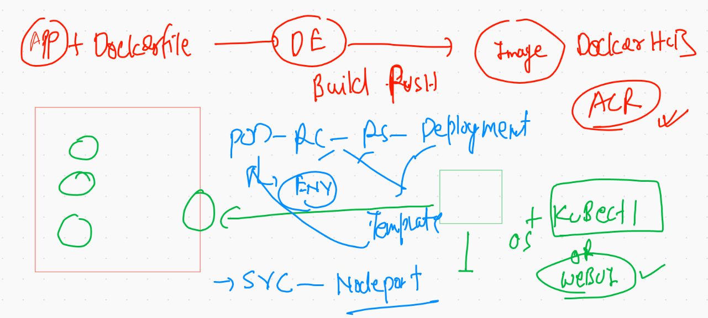

# Summary of container & orchestration 



## cleaning up namespace  data

```
❯ kubectl config get-contexts
CURRENT   NAME                          CLUSTER      AUTHINFO           NAMESPACE
*         kubernetes-admin@kubernetes   kubernetes   kubernetes-admin   ashu-jci
          minikube                      minikube     minikube           default
❯ kubectl  get  po
NAME              READY   STATUS    RESTARTS   AGE
ashurc123-4mh6x   1/1     Running   1          17h
ashurc123-kcchh   1/1     Running   1          17h
ashurc123-qwf29   1/1     Running   1          17h
❯ kubectl  get  all
NAME                  READY   STATUS    RESTARTS   AGE
pod/ashurc123-4mh6x   1/1     Running   1          17h
pod/ashurc123-kcchh   1/1     Running   1          17h
pod/ashurc123-qwf29   1/1     Running   1          17h

NAME                              DESIRED   CURRENT   READY   AGE
replicationcontroller/ashurc123   3         3         3       18h

NAME          TYPE       CLUSTER-IP    EXTERNAL-IP   PORT(S)          AGE
service/ss1   NodePort   10.96.223.6   <none>        1234:31669/TCP   17h
❯ kubectl  delete all --all
pod "ashurc123-4mh6x" deleted
pod "ashurc123-kcchh" deleted
pod "ashurc123-qwf29" deleted
replicationcontroller "ashurc123" deleted
service "ss1" deleted


```

## Getting started with Deployment 

### creating yaml file 

```
❯ kubectl  create  deployment   ashuwebapp  --image=dockerashu/httpd:jcimultiappv1 --dry-run=client -o yaml
apiVersion: apps/v1
kind: Deployment
metadata:
  creationTimestamp: null
  labels:
    app: ashuwebapp
  name: ashuwebapp
spec:
  replicas: 1
  selector:
    matchLabels:
      app: ashuwebapp
  strategy: {}
  template:
    metadata:
      creationTimestamp: null
      labels:
        app: ashuwebapp
    spec:
      containers:
      - image: dockerashu/httpd:jcimultiappv1
        name: httpd
        resources: {}
status: {}
❯ kubectl  create  deployment   ashuwebapp  --image=dockerashu/httpd:jcimultiappv1 --dry-run=client -o yaml  >ashudep.yml

```

## Deployment deploy

```
❯ ls
aa.json          ashudep.yml      autopod.yaml     customerapp2.yml mypod.yml
ashu-rc1.yaml    ashupod1.yaml    customerapp1.yml deploy.yml       svc1.yaml
❯ kubectl  get  deployments
No resources found in ashu-jci namespace.
❯ kubectl  get  deploy
No resources found in ashu-jci namespace.
❯ kubectl  apply -f  ashudep.yml
deployment.apps/ashuwebapp created
❯ kubectl  get  deploy
NAME         READY   UP-TO-DATE   AVAILABLE   AGE
ashuwebapp   1/1     1            1           5s
❯ kubectl  get  rs
NAME                    DESIRED   CURRENT   READY   AGE
ashuwebapp-5cfc9f66c9   1         1         1       10s
❯ kubectl  get  po
NAME                          READY   STATUS    RESTARTS   AGE
ashuwebapp-5cfc9f66c9-x45xp   1/1     Running   0          13s

```

## rechecking 

```
❯ kubectl  get  deploy
NAME         READY   UP-TO-DATE   AVAILABLE   AGE
ashuwebapp   1/1     1            1           4m27s
❯ kubectl  get   rs
NAME                    DESIRED   CURRENT   READY   AGE
ashuwebapp-5cfc9f66c9   1         1         1       4m42s
❯ kubectl  get   po
NAME                          READY   STATUS    RESTARTS   AGE
ashuwebapp-5cfc9f66c9-x45xp   1/1     Running   0          4m48s
❯ kubectl  get   po -o wide
NAME                          READY   STATUS    RESTARTS   AGE     IP               NODE                            NOMINATED NODE   READINESS GATES
ashuwebapp-5cfc9f66c9-x45xp   1/1     Running   0          4m51s   192.168.249.75   ip-172-31-41-131.ec2.internal   <none>           <none>
❯ kubectl get  no
NAME                            STATUS   ROLES                  AGE   VERSION
ip-172-31-34-76.ec2.internal    Ready    <none>                 42h   v1.21.1
ip-172-31-37-20.ec2.internal    Ready    <none>                 42h   v1.21.1
ip-172-31-41-131.ec2.internal   Ready    <none>                 42h   v1.21.1
ip-172-31-41-71.ec2.internal    Ready    control-plane,master   42h   v1.21.1


```

## service creation tips 


### creating expose based service 

```
kubectl  expose deployment  ashuwebapp  --type NodePort --port 80 --namespace=ashu-jci  --dry-run=client -o yaml
apiVersion: v1
kind: Service
metadata:
  creationTimestamp: null
  labels:
    x: ashuwebapp
  name: ashuwebapp
  namespace: ashu-jci
spec:
  ports:
  - port: 80
    protocol: TCP
    targetPort: 80
  selector:
    app: ashuwebapp
  type: NodePort
status:
  loadBalancer: {}

```

## redeploy yaml 

```
❯ kubectl  apply -f  ashudep.yml
deployment.apps/ashuwebapp configured
service/ashuwebapp created
❯ kubectl  get  svc
NAME         TYPE       CLUSTER-IP      EXTERNAL-IP   PORT(S)        AGE
ashuwebapp   NodePort   10.101.75.228   <none>        80:32312/TCP   8s

```

## checking details of deployment like  revision number 

```
❯ kubectl  get  deploy
NAME         READY   UP-TO-DATE   AVAILABLE   AGE
ashuwebapp   1/1     1            1           27m
❯ kubectl  describe  deploy ashuwebapp
Name:                   ashuwebapp
Namespace:              ashu-jci
CreationTimestamp:      Thu, 03 Jun 2021 09:39:25 +0530
Labels:                 x=ashuwebapp
Annotations:            deployment.kubernetes.io/revision: 1
Selector:               app=ashuwebapp
Replicas:               1 desired | 1 updated | 1 total | 1 available | 0 unavailable
StrategyType:           RollingUpdate
MinReadySeconds:        0
RollingUpdateStrategy:  25% max unavailable, 25% max surge
Pod Template:
  Labels:  app=ashuwebapp
  Containers:
   httpd:
    Image:      dockerashu/httpd:jcimultiappv1
    Port:       <none>
    Host Port:  <none>
    Environment:

```

### scaling pod 

```
❯ kubectl  get  deploy
NAME         READY   UP-TO-DATE   AVAILABLE   AGE
ashuwebapp   1/1     1            1           30m
❯ kubectl   scale deployment  ashuwebapp  --replicas=3
deployment.apps/ashuwebapp scaled
❯ kubectl  get  deploy
NAME         READY   UP-TO-DATE   AVAILABLE   AGE
ashuwebapp   3/3     3            3           30m
❯ kubectl  get  po
NAME                          READY   STATUS    RESTARTS   AGE
ashuwebapp-5cfc9f66c9-n79kk   1/1     Running   0          8s
ashuwebapp-5cfc9f66c9-x45xp   1/1     Running   0          30m
ashuwebapp-5cfc9f66c9-zjgm6   1/1     Running   0          8s

```

## updating image in existing deployment 

```
 kubectl  set  image  deployment   ashuwebapp  httpd=dockerashu/httpd:jcimultiappv2
deployment.apps/ashuwebapp image updated

```

### deployment history 

```
0106  kubectl  describe deploy ashuwebapp  
10107  history
10108  kubectl  describe deploy ashuwebapp  
10109* kubectl  set  image  deployment   ashuwebapp  httpd=dockerashu/httpd:jcimultiappv2 
10110  kubectl  get  deploy 
10111  kubectl  get  po
10112  kubectl  describe deploy ashuwebapp  

```

## History and current revesion number 

```
❯ kubectl  rollout history deployment   ashuwebapp
deployment.apps/ashuwebapp 
REVISION  CHANGE-CAUSE
1         <none>
2         <none>

❯ kubectl  describe deploy ashuwebapp
Name:                   ashuwebapp
Namespace:              ashu-jci
CreationTimestamp:      Thu, 03 Jun 2021 09:39:25 +0530
Labels:                 x=ashuwebapp
Annotations:            deployment.kubernetes.io/revision: 2
Selector:               app=ashuwebapp

```

### rolling back by using revision number -- 

## Note: you can also set image to roll back 

```
❯ kubectl  rollout undo deployment   ashuwebapp --to-revision=1
deployment.apps/ashuwebapp rolled back
❯ kubectl  get  po
NAME                          READY   STATUS        RESTARTS   AGE
ashuwebapp-5cfc9f66c9-p65zx   1/1     Running       0          17s
ashuwebapp-5cfc9f66c9-r4ndb   1/1     Running       0          20s
ashuwebapp-5cfc9f66c9-rxq8b   1/1     Running       0          22s
ashuwebapp-75dcd5c7b6-h2g7b   1/1     Terminating   0          5m29s
ashuwebapp-75dcd5c7b6-lbdq6   1/1     Terminating   0          5m27s
ashuwebapp-75dcd5c7b6-vvpgc   1/1     Terminating   0          5m25s

```

# Storage in k8s 


## k8s volume concepts 


### volume docs link 

[link](https://kubernetes.io/docs/concepts/storage/volumes/)


## EmptyDir volume type


### creating pod 

```

kubectl   run  emppod  --image=alpine --namespace ashu-jci  --dry-run=client -o yaml  >empvol.yml
```

### replacing parent process of container in k8s


## deploying pod 

```
❯ kubectl  apply -f empvol.yml
pod/emppod created
❯ kubectl  get  po
NAME     READY   STATUS    RESTARTS   AGE
emppod   1/1     Running   0          9s

```

## checking volume mounts 

```
❯ kubectl describe pod  emppod
Name:         emppod
Namespace:    ashu-jci
Priority:     0
Node:         ip-172-31-41-131.ec2.internal/172.31.41.131
Start Time:   Thu, 03 Jun 2021 12:25:24 +0530
Labels:       run=emppod
Annotations:  cni.projectcalico.org/podIP: 192.168.249.105/32
Status:       Running
IP:           192.168.249.105
IPs:
  IP:  192.168.249.105
Containers:
  emppod:
    Container ID:  docker://790ecc0d7f53591a6ed421cb0752128391ad4a93f5352eb65964fca31e01fd17
    Image:         alpine
    Image ID:      docker-pullable://alpine@sha256:69e70a79f2d41ab5d637de98c1e0b055206ba40a8145e7bddb55ccc04e13cf8f
    Port:          <none>
    Host Port:     <none>
    Command:
      /bin/sh
      -c
      while true;do echo hii >>/mnt/jci/a.txt;sleep 5;done
    State:          Running
      Started:      Thu, 03 Jun 2021 12:25:26 +0530
    Ready:          True
    Restart Count:  0
    Environment:    <none>
    Mounts:
      /mnt/jci from ashuvol1 (rw)
      /var/run/secrets/kubernetes.io/servicea
      
```

### checking pods 

```
10137  kubectl  exec  -it  emppod  -- sh 
❯ kubectl  exec  -it  emppod  -- sh
/ # cd /mnt/jci/
/mnt/jci # ls
a.txt
/mnt/jci # exit

```

## Pod with more than one container -- helper / sidecar container 


## adding. sidecar container 

```
❯ kubectl  get  po
NAME     READY   STATUS    RESTARTS   AGE
emppod   1/1     Running   0          24m
❯ kubectl  apply -f empvol.yml
The Pod "emppod" is invalid: spec.containers: Forbidden: pod updates may not add or remove containers
❯ kubectl  replace -f  empvol.yml --force
pod "emppod" deleted
pod/emppod replaced

```

### accessing two container inside a single pod 

```
❯ kubectl  get  po
NAME     READY   STATUS    RESTARTS   AGE
emppod   2/2     Running   0          93s
❯ kubectl exec -it  emppod  -c  ashuc1  --  bash
root@emppod:/# cd /usr/share/nginx/html/
root@emppod:/usr/share/nginx/html# ls
a.txt
root@emppod:/usr/share/nginx/html# exit
exit
❯ kubectl exec -it  emppod  -c  emppod  --  sh
/ # cd /mnt/jci/
/mnt/jci # ls
a.txt
/mnt/jci # exit

```

### creating serivce 

```
 kubectl  expose pod  emppod  --type NodePort --port 80 --target-port 80 --name svcc1
service/svcc1 exposed
❯ kubectl  get  svc
NAME    TYPE       CLUSTER-IP       EXTERNAL-IP   PORT(S)        AGE
svcc1   NodePort   10.105.183.228   <none>        80:32584/TCP   4s

```

# Host Path volume type


### deploy 

```
❯ kubectl  apply -f  hostp.yml
pod/hostpod1 created
❯ kubectl  get  po
NAME       READY   STATUS    RESTARTS   AGE
hostpod1   1/1     Running   0          3s
❯ kubectl  exec -it  hostpdo1  -- sh
Error from server (NotFound): pods "hostpdo1" not found
❯ kubectl  exec -it  hostpod1  -- sh
/ # cd  /myhostetc/
/myhostetc # ls
DIR_COLORS               default                  issue.net                passwd                   selinux
DIR_COLORS.256color      depmod.d                 krb5.conf                passwd-                  services
DIR_COLORS.lightbgcolor  dhcp                     krb5.conf.d              pkcs11                   sestatus.conf
GREP_COLORS              docker                   kubernetes               pki                      setuptool.d
GeoIP.conf               docker-runtimes.d        ld.so.cache              plymouth                 shadow
GeoIP.conf.default       dracut.conf              ld.so.conf               pm                       shadow-
NetworkManager           dracut.conf.d            ld.so.conf.d             popt.d                   shells
X11                      e2fsck.conf              libaudit.conf            postfix                  skel
acpi                     environment  

```

## PV & PVC -- with demo 


## creating pv 

```
❯ kubectl  get  pv
NAME             CAPACITY   ACCESS MODES   RECLAIM POLICY   STATUS      CLAIM                     STORAGECLASS   REASON   AGE
ashupv-123       10Gi       RWO            Retain           Available                             fast                    16m
asifpv-123       5Gi        RWX            Retain           Bound       asif/asifpvc              fast                    10m
hppv-123         10Gi       RWO            Retain           Available                             fast                    8m14s
kiranpv          10Gi       RWX            Retain           Available                             veryfast                79s
prachipv-1       5Gi        RWO            Retain           Bound       prachi-jci/prachipvc      fast                    15m
prashantpv-123   7Gi        RWX            Retain           Bound       priyankajci/priyankapvc   fast                    11m
priyankapv-123   3Gi        RWX            Retain           Available                             fast                    14m
rajeshpod-day2   5Gi        RWO            Retain           Available                             fast                    11m
rajeshpv         5Gi        RWO            Retain           Bound       rajeshns/rajeshpvc        fast                    8m57s
rajkpv-1010      7Gi        ROX            Retain           Available                             fast                    12m
sagarpv-123      10Gi       RWX            Retain           Bound       ashu-jci/ashupvc          fast                    11m
saket12          8Gi        RWX            Retain           Available                             fast                    12m
shalompv         10Gi       RWO            Retain           Available                             fast                    16m
tape123          7Gi        RWX            Retain           Bound       jci-tapender/tapepvc      fast                    13m
tarupv-123       10Gi       RWO            Retain           Bound       harendra/hppvc            fast                    9m31s
vipinpv-123      10Gi       RWO            Retain           Available                     

```

## claiming pv using pvc 

```
❯ kubectl  get  pvc
NAME      STATUS   VOLUME        CAPACITY   ACCESS MODES   STORAGECLASS   AGE
ashupvc   Bound    sagarpv-123   10Gi       RWX            fast           2m24s

```

## Deploy yaml of mysql DB 


```
 kubectl  create   deployment  ashudb  --image=mysql:5.6  --dry-run=client -o yaml   >ashudb.yaml
 
```

## INtroduction to secret 


## creating secret for db password storage purpose 

```
❯ kubectl  create  secret   generic   ashudbsec   --from-literal  passkey1=JciDb088  --namespace ashu-jci
secret/ashudbsec created
❯ kubectl  get  secret
NAME                  TYPE                                  DATA   AGE
ashudbsec             Opaque                                1      8s
default-token-gxn2k   kubernetes.io/service-account-token   3      25h

```

### deploying db deployment file 

```
❯ kubectl apply -f  ashudb.yaml --dry-run=client
deployment.apps/ashudb created (dry run)
❯ kubectl apply -f  ashudb.yaml
deployment.apps/ashudb created
❯ kubectl  get deploy
NAME     READY   UP-TO-DATE   AVAILABLE   AGE
ashudb   1/1     1            1           8s


```

### Creting clusterIP type service to DB pod 

```
❯ kubectl   get  deploy
NAME     READY   UP-TO-DATE   AVAILABLE   AGE
ashudb   1/1     1            1           7m32s
❯ kubectl  expose  deploy ashudb  --type ClusterIP  --port 3306  --dry-run=client -o yaml
apiVersion: v1
kind: Service
metadata:
  creationTimestamp: null
  labels:
    app: ashudb
  name: ashudb
spec:
  ports:
  - port: 3306
    protocol: TCP
    targetPort: 3306
  selector:
    app: ashudb
  type: ClusterIP
status:
  loadBalancer: {}
❯ kubectl  expose  deploy ashudb  --type ClusterIP  --port 3306  --dry-run=client -o yaml   >dbsvc.yaml
❯ kubectl  expose  deploy ashudb  --type ClusterIP  --port 3306  --namespace ashu-jci --dry-run=client -o yaml   >dbsvc.yaml

```


## Deploy service 

```
 kubectl  apply -f  dbsvc.yaml
service/ashudb created


```

## summary of mysql DB deployment 

```
❯ kubectl get  pvc
NAME      STATUS   VOLUME        CAPACITY   ACCESS MODES   STORAGECLASS   AGE
ashupvc   Bound    sagarpv-123   10Gi       RWX            fast           44m
❯ kubectl get  secret
NAME                  TYPE                                  DATA   AGE
ashudbsec             Opaque                                1      17m
default-token-gxn2k   kubernetes.io/service-account-token   3      25h
❯ kubectl get  deploy
NAME     READY   UP-TO-DATE   AVAILABLE   AGE
ashudb   1/1     1            1           11m
❯ kubectl get  po
NAME                     READY   STATUS    RESTARTS   AGE
ashudb-778b46674-jxw4r   1/1     Running   0          11m
❯ kubectl get  svc
NAME     TYPE        CLUSTER-IP      EXTERNAL-IP   PORT(S)    AGE
ashudb   ClusterIP   10.103.161.14   <none>        3306/TCP   56s

```

## creting yaml of webapp 

```
kubectl  create  deployment  ashuwebapp1  --image=wordpress:4.8-apache --namespace ashu-jci  --dry-run=client -o yaml  >webapp.yaml

```

### creating service 

```
❯ kubectl  get  deploy
NAME          READY   UP-TO-DATE   AVAILABLE   AGE
ashudb        1/1     1            1           44m
ashuwebapp1   1/1     1            1           79s
❯ kubectl  get  po
NAME                           READY   STATUS    RESTARTS   AGE
ashudb-778b46674-jxw4r         1/1     Running   0          44m
ashuwebapp1-66c9547dc5-72v4f   1/1     Running   0          84s
❯ kubectl  get  svc
NAME     TYPE        CLUSTER-IP      EXTERNAL-IP   PORT(S)    AGE
ashudb   ClusterIP   10.103.161.14   <none>        3306/TCP   33m
❯ kubectl  expose deploy  ashuwebapp1 --type NodePort  --port 80 --dry-run=client -o yaml  >websvc.yml
❯ 
❯ 
❯ kubectl  expose deploy  ashuwebapp1 --type NodePort  --port 80 --namespace ashu-jci --dry-run=client -o yaml  >websvc.yml
❯ 

```

###

```
❯ kubectl apply -f  websvc.yml
service/ashuwebapp1 created
❯ kubectl  get deploy,pod,svc
NAME                          READY   UP-TO-DATE   AVAILABLE   AGE
deployment.apps/ashudb        1/1     1            1           46m
deployment.apps/ashuwebapp1   1/1     1            1           3m13s

NAME                               READY   STATUS    RESTARTS   AGE
pod/ashudb-778b46674-jxw4r         1/1     Running   0          46m
pod/ashuwebapp1-66c9547dc5-72v4f   1/1     Running   0          3m13s

NAME                  TYPE        CLUSTER-IP      EXTERNAL-IP   PORT(S)        AGE
service/ashudb        ClusterIP   10.103.161.14   <none>        3306/TCP       35m
service/ashuwebapp1   NodePort    10.99.134.217   <none>        80:31454/TCP   8s

```

## service account 


## K8s dashboard deployment 

```
❯ kubectl apply -f https://raw.githubusercontent.com/kubernetes/dashboard/v2.2.0/aio/deploy/recommended.yaml
namespace/kubernetes-dashboard created
serviceaccount/kubernetes-dashboard created
service/kubernetes-dashboard created
secret/kubernetes-dashboard-certs created
secret/kubernetes-dashboard-csrf created
secret/kubernetes-dashboard-key-holder created
configmap/kubernetes-dashboard-settings created
role.rbac.authorization.k8s.io/kubernetes-dashboard created
clusterrole.rbac.authorization.k8s.io/kubernetes-dashboard created
rolebinding.rbac.authorization.k8s.io/kubernetes-dashboard created
clusterrolebinding.rbac.authorization.k8s.io/kubernetes-dashboard created
deployment.apps/kubernetes-dashboard created
service/dashboard-metrics-scraper created


```

## checking 

```
❯ kubectl  get  all -n kubernetes-dashboard
NAME                                             READY   STATUS    RESTARTS   AGE
pod/dashboard-metrics-scraper-856586f554-dccwc   1/1     Running   0          18s
pod/kubernetes-dashboard-78c79f97b4-ftx4q        1/1     Running   0          19s

NAME                                TYPE        CLUSTER-IP      EXTERNAL-IP   PORT(S)    AGE
service/dashboard-metrics-scraper   ClusterIP   10.107.214.55   <none>        8000/TCP   20s
service/kubernetes-dashboard        ClusterIP   10.108.33.170   <none>        443/TCP    27s

NAME                                        READY   UP-TO-DATE   AVAILABLE   AGE
deployment.apps/dashboard-metrics-scraper   1/1     1            1           19s
deployment.apps/kubernetes-dashboard        1/1     1            1           20s

NAME                                                   DESIRED   CURRENT   READY   AGE
replicaset.apps/dashboard-metrics-scraper-856586f554   1         1         1       19s
replicaset.apps/kubernetes-dashboard-78c79f97b4        1         1         1       20s
❯ kubectl  get sa  -n kubernetes-dashboard
NAME                   SECRETS   AGE
default                1         45s
kubernetes-dashboard   1         44s
❯ kubectl  get secret   -n kubernetes-dashboard
NAME                               TYPE                                  DATA   AGE
default-token-6sdnw                kubernetes.io/service-account-token   3      55s
kubernetes-dashboard-certs         Opaque                                0      52s
kubernetes-dashboard-csrf          Opaque                                1      52s
kubernetes-dashboard-key-holder    Opaque                                2      51s
kubernetes-dashboard-token-kmd4f   kubernetes.io/service-account-token   3      54s

```

### change svc to nodeport 

```
❯ kubectl  edit   svc  kubernetes-dashboard       -n kubernetes-dashboard
service/kubernetes-dashboard edited
❯ kubectl  get  svc   -n kubernetes-dashboard
NAME                        TYPE        CLUSTER-IP      EXTERNAL-IP   PORT(S)         AGE
dashboard-metrics-scraper   ClusterIP   10.107.214.55   <none>        8000/TCP        2m47s
kubernetes-dashboard        NodePort    10.108.33.170   <none>        443:31336/TCP   2m54s

░▒▓ ~ ······································

```

### dashboard summary 

```
10270  kubectl apply -f https://raw.githubusercontent.com/kubernetes/dashboard/v2.2.0/aio/deploy/recommended.yaml
10271  kubectl  get  ns
10272  kubectl  get  all -n kubernetes-dashboard 
10273  kubectl  get sa  -n kubernetes-dashboard 
10274  kubectl  get secret   -n kubernetes-dashboard 
10275  kubectl  get  po 
10276  kubectl  get  po  -n kubernetes-dashboard 
10277  kubectl  get  svc   -n kubernetes-dashboard 
10278  kubectl  edit   svc  kubernetes-dashboard       -n kubernetes-dashboard 
10279  kubectl  get  svc   -n kubernetes-dashboard 
10280  kubectl  get no
10281  kubectl  get  secret   -n kubernetes-dashboard 
10282  kubectl  describe  secret   kubernetes-dashboard-token-kmd4f   -n kubernetes-dashboard 
10283  kubectl  get  sa   -n kubernetes-dashboard 


```


 
 
