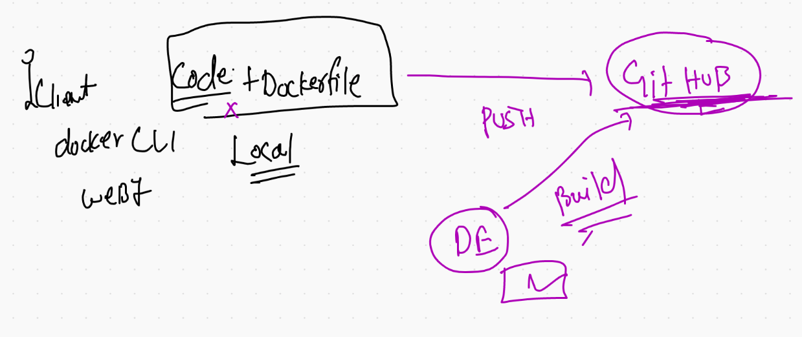
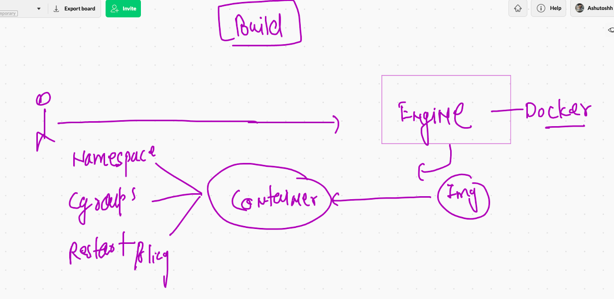
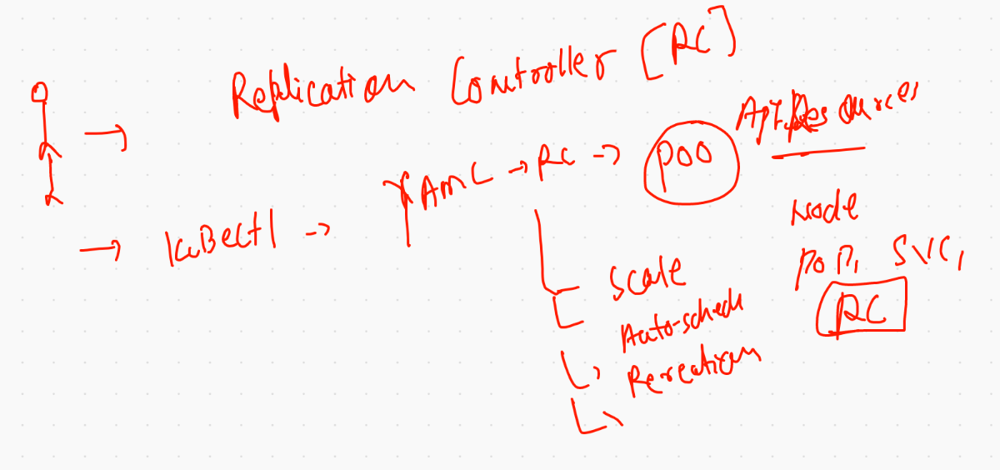
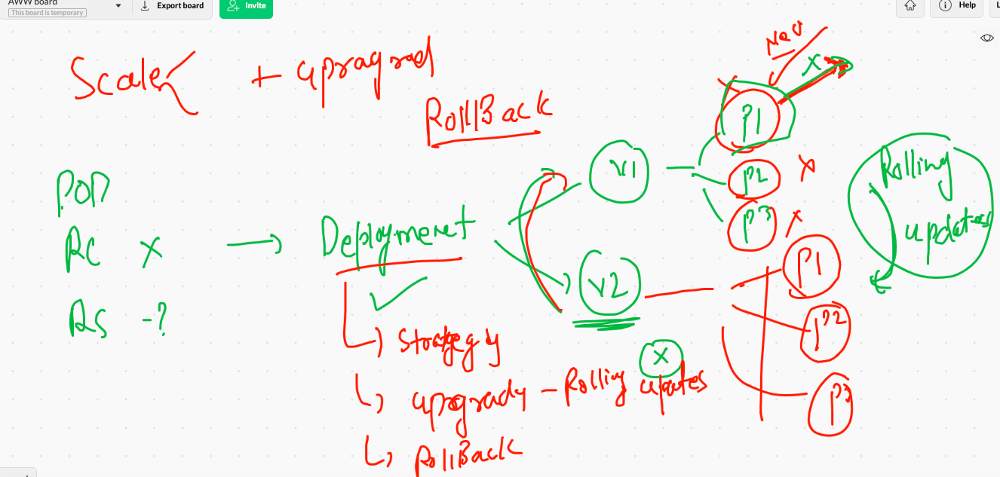

# Docker revision 


## Docker build from Git repo 



## COntainer internal more concepts 



## Dockerfile more keywords with webapp example 


## BUilding webapp docker image 

```
 docker  build  -t  httpd:JCI1june2021v1 .
Sending build context to Docker daemon     64kB
Step 1/8 : FROM  fedora
 ---> 055b2e5ebc94
Step 2/8 : LABEL "author.name"="ashutoshh singh"
 ---> Running in 5d9c171adb68
Removing intermediate container 5d9c171adb68
 ---> 44f932710df1
Step 3/8 : LABEL "author.email"="ashutoshh@linux.com"
 ---> Running in 768c34090eac
Removing intermediate container 768c3409

```

### DOcker image build history 

```
 docker  history httpd:JCIashuv1
IMAGE          CREATED          CREATED BY                                      SIZE      COMMENT
98b7f0d9e2e6   9 minutes ago    /bin/sh -c #(nop)  ENTRYPOINT ["/bin/sh" "-c…   0B        
0257c13c8461   9 minutes ago    /bin/sh -c #(nop)  EXPOSE 80                    0B        
ca77376fb13a   9 minutes ago    /bin/sh -c #(nop) ADD dir:a10de42d8e22bf749b…   57.1kB    
8eb4b25a39c1   11 minutes ago   /bin/sh -c dnf install httpd -y                 248MB     
6aa235133297   12 minutes ago   /bin/sh -c #(nop)  LABEL client=JCI             0B        
3668a0348619   12 minutes ago   /bin/sh -c #(nop)  LABEL author.email=ashuto…   0B        
44f932710df1   12 minutes ago   /bin/sh -c #(nop)  LABEL author.name=ashutos…   0B        
055b2e5ebc94   2 weeks ago      /bin/sh -c #(nop)  CMD ["/bin/bash"]            0B        
<missing>      2 weeks ago      /bin/sh -c #(nop) ADD file:f8b822814d179a767…   178MB     
<missing>      2 months ago     /bin/sh -c #(nop)  ENV DISTTAG=f34container …   0B        
<missing>      2 months ago     /bin/sh -c #(nop)  LABEL maintainer=Clement …   0B  

```

### creating container 

```
 docker run -itd --name ashuwebc1  -p  1234:80  httpd:JCIashuv1
```

### Container port forwarding 


### image push to docker hub 

```
❯ docker  tag   httpd:JCIashuv1  dockerashu/httpd:JCIashuv1
❯ docker  login -u dockerashu
Password: 
Login Succeeded
❯ docker push dockerashu/httpd:JCIashuv1
The push refers to repository [docker.io/dockerashu/httpd]
c8c0e6699969: Pushed 
f9eaf2c89654: Pushed 
96505a9aeedd: Mounted from library/fedora 
JCIashuv1: digest: sha256:d5cfa9531cc47135d487333db627a9605f1b7be436a0e09dd2e77562a25b8827 size: 951
❯ docker  logout
Removing login credentials for https://index.docker.io/v1/

```

## Container oriented problem for app deploy 


##  Container orchestraion tools / engine 


# Kubernetes k8s 

## Level 1 architecutre 


## k8s apiserver 


## kube-schedular 


## Kube-controller-manager 


### node-controller 


## replication controller 



## ETCD the brain of k8s 


## CNI -- for container networking 


## Minion kube-proxy + CNI + kubelet 


## kubernetes cluster Deployment methods 


## Minikube based local cluster deployment 


## Installing Minikube in mac 

```
❯ curl -LO https://storage.googleapis.com/minikube/releases/latest/minikube-darwin-amd64
  % Total    % Received % Xferd  Average Speed   Time    Time     Time  Current
                                 Dload  Upload   Total   Spent    Left  Speed
100 60.3M  100 60.3M    0     0  6583k      0  0:00:09  0:00:09 --:--:-- 7470k
❯ sudo install minikube-darwin-amd64 /usr/local/bin/minikube
Password:
❯ minikube version
minikube version: v1.20.0
commit: c61663e942ec43b20e8e70839dcca52e44cd85ae

```

## creating cluster 


```
 minikube  start  --driver=docker
😄  minikube v1.20.0 on Darwin 11.2.3
✨  Using the docker driver based on user configuration
👍  Starting control plane node minikube in cluster minikube
🚜  Pulling base image ...
🔥  Creating docker container (CPUs=2, Memory=1988MB) ...
🐳  Preparing Kubernetes v1.20.2 on Docker 20.10.6 ...
    ▪ Generating certificates and keys ...
    ▪ Booting up control plane ...
    ▪ Configuring RBAC rules ...
🔎  Verifying Kubernetes components...
    ▪ Using image gcr.io/k8s-minikube/storage-provisioner:v5
🌟  Enabled addons: storage-provisioner, default-storageclass
🏄  Done! kubectl is now configured to use "minikube" cluster and "default" namespace by default

```


## Installing k8s cluster using kubeadm 

## Note: common.sh needs to run in all the machine then 

### only on the system you want to configure as master node 

#### NOte: In CKA. exam you just need to do --  kubeadm   init  --pod-network-cidr=192.168.0.0/16


```
[root@ip-172-31-41-71 ~]# kubeadm   init  --pod-network-cidr=192.168.0.0/16   --apiserver-advertise-address=0.0.0.0  --apiserver-cert-extra-sans=34.237.219.131,172.31.41.71  
[init] Using Kubernetes version: v1.21.1
[preflight] Running pre-flight checks
	[WARNING IsDockerSystemdCheck]: detected "cgroupfs" as the Docker cgroup driver. The recommended driver is "systemd". Please follow the guide at https://kubernetes.io/docs/setup/cri/
	[WARNING FileExisting-tc]: tc not found in system path
[preflight] Pulling images required for setting up a Kubernetes cluster
[preflight] This might take a minute or two, depending on the speed of your internet connection
[preflight] You can also perform this action in beforehand using 'kubeadm config images pull'
[certs] Using certificateDir folder "/etc/kubernetes/pki"
[certs] Generating "ca" certif


```

## ON kubernetes master 

### COnfiguration directory 

```
[root@ip-172-31-41-71 kubernetes]# cd  /etc/kubernetes/
[root@ip-172-31-41-71 kubernetes]# 
[root@ip-172-31-41-71 kubernetes]# ls
admin.conf  controller-manager.conf  kubelet.conf  manifests  pki  scheduler.conf
[root@ip-172-31-41-71 kubernetes]# 

```

### Client shared certificate 

```
[root@ip-172-31-41-71 kubernetes]# ls
admin.conf  controller-manager.conf  kubelet.conf  manifests  pki  scheduler.conf
[root@ip-172-31-41-71 kubernetes]# cat  admin.conf 
apiVersion: v1
clusters:
- cluster:
    certificate-authority-data: LS0tLS1CRUdJTiBDRVJUSUZJQ0FURS0tLS0tCk1JSUM1ekNDQWMrZ0F3SUJBZ0lCQURBTkJna3Foa2lHOXcwQkFRc0ZBREFWTVJNd0VRWURWUVFERXdwcmRXSmwKY201bGRHVnpNQjRYRFRJeE1EWXdNVEE1TkRBMU1Gb1hEVE14TURVek1EQTVOREExTUZvd0ZURVRNQkVHQTFVRQpBeE1LYTNWaVpYSnVaWFJsY3pDQ0FTSXdEUVlKS29aSWh2Y05BUUVCQlFBRGd
    
```

### CNI deployment  

```
 wget https://docs.projectcalico.org/manifests/calico.yaml
   48  ls
   49  cat  calico.yaml 
   
 kubectl apply -f  calico.yaml
 
 ```
 
 ## From client system we are connecting to master node apiserver 
 
 ```
 
 ❯ kubectl   get   nodes  --kubeconfig  admin.conf
NAME                            STATUS   ROLES                  AGE   VERSION
ip-172-31-34-76.ec2.internal    Ready    <none>                 15m   v1.21.1
ip-172-31-37-20.ec2.internal    Ready    <none>                 15m   v1.21.1
ip-172-31-41-131.ec2.internal   Ready    <none>                 16m   v1.21.1
ip-172-31-41-71.ec2.internal    Ready    control-plane,master   22m   v1.21.1

```

### checking version 

```
❯ kubectl   version  --kubeconfig  admin.conf
Client Version: version.Info{Major:"1", Minor:"21", GitVersion:"v1.21.1", GitCommit:"5e58841cce77d4bc13713ad2b91fa0d961e69192", GitTreeState:"clean", BuildDate:"2021-05-12T14:18:45Z", GoVersion:"go1.16.4", Compiler:"gc", Platform:"darwin/amd64"}
Server Version: version.Info{Major:"1", Minor:"21", GitVersion:"v1.21.1", GitCommit:"5e58841cce77d4bc13713ad2b91fa0d961e69192", GitTreeState:"clean", BuildDate:"2021-05-12T14:12:29Z", GoVersion:"go1.16.4", Compiler:"gc", Platform:"linux/amd64"}

```

### more checking 

```
❯ kubectl   cluster-info  --kubeconfig  admin.conf
Kubernetes control plane is running at https://34.237.219.131:6443
CoreDNS is running at https://34.237.219.131:6443/api/v1/namespaces/kube-system/services/kube-dns:dns/proxy

```

## Copy admin.conf to users home directory location 

```
 cp  -v admin.conf  /Users/fire/.kube/config
admin.conf -> /Users/fire/.kube/config
❯ kubectl  get  nodes
NAME                            STATUS   ROLES                  AGE   VERSION
ip-172-31-34-76.ec2.internal    Ready    <none>                 23m   v1.21.1
ip-172-31-37-20.ec2.internal    Ready    <none>                 23m   v1.21.1
ip-172-31-41-131.ec2.internal   Ready    <none>                 23m   v1.21.1
ip-172-31-41-71.ec2.internal    Ready    control-plane,master   29m   v1.21.1
❯ kubectl  cluster-info
Kubernetes control plane is running at https://34.237.219.131:6443
CoreDNS is running at https://34.237.219.131:6443/api/v1/namespaces/kube-system/services/kube-dns:dns/proxy

```

### Admin.conf right location 


### kubeadm based installion of  cluster is done 


## Docker depricated by k8s. -- reality check 


## Docker image build and push -- deploy 



## game of pods 


## a more close look to pod 


### switching to minikube cluster 

```

 minikube  stop
✋  Stopping node "minikube"  ...
🛑  Powering off "minikube" via SSH ...
🛑  1 nodes stopped.
❯ minikube  start
😄  minikube v1.20.0 on Darwin 11.2.3
✨  Using the docker driver based on existing profile
👍  Starting control plane node minikube in cluster minikube
🚜  Pulling base image ...
🔄  Restarting existing docker container for "minikube" ...
🐳  Preparing Kubernetes v1.20.2 on Docker 20.10.6 ...
🔎  Verifying Kubernetes components...
    ▪ Using image gcr.io/k8s-minikube/storage-provisioner:v5
🌟  Enabled addons: default-storageclass, storage-provisioner
🏄  Done! kubectl is now configured to use "minikube" cluster and "default" namespace by default
❯ kubectl   get  nodes
NAME       STATUS   ROLES                  AGE    VERSION
minikube   Ready    control-plane,

```

### deploy 

```

❯ kubectl   get  nodes
NAME       STATUS   ROLES                  AGE    VERSION
minikube   Ready    control-plane,master   146m   v1.20.2
❯ kubectl  get  pods
No resources found in default namespace.
❯ ls
ashupod1.yaml
❯ kubectl  apply -f  ashupod1.yaml --dry-run=client
pod/ashupod-123 created (dry run)
❯ kubectl  apply -f  ashupod1.yaml
pod/ashupod-123 created
❯ kubectl  get  pods
NAME          READY   STATUS              RESTARTS   AGE
ashupod-123   0/1     ContainerCreating   0          4s
❯ kubectl  get  pods
NAME          READY   STATUS              RESTARTS   AGE
ashupod-123   0/1     ContainerCreating   0          12s
❯ kubectl  get  pods -w
NAME          READY   STATUS              RESTARTS   AGE
ashupod-123   0/1     ContainerCreating   0          15s


```


 
 

