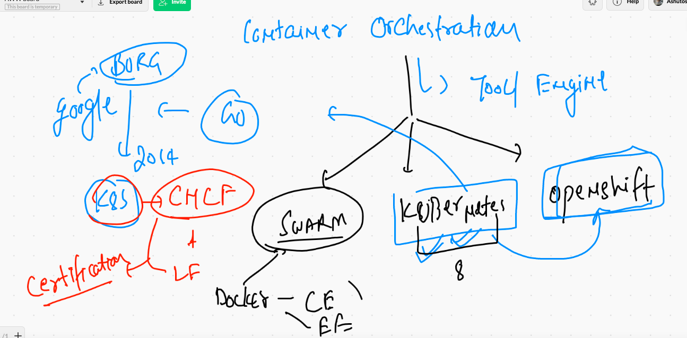
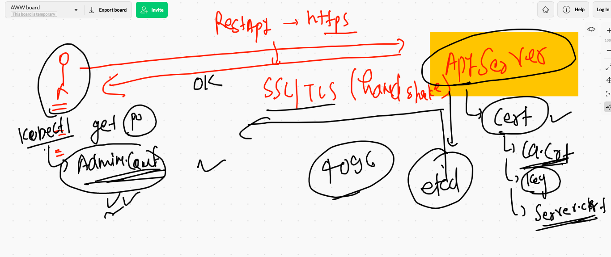

# Docker revision 


## Docker build from Git repo 


## COntainer internal more concepts 


## Dockerfile more keywords with webapp example 


## BUilding webapp docker image 

```
 docker  build  -t  httpd:JCI1june2021v1 .
Sending build context to Docker daemon     64kB
Step 1/8 : FROM  fedora
 ---> 055b2e5ebc94
Step 2/8 : LABEL "author.name"="ashutoshh singh"
 ---> Running in 5d9c171adb68
Removing intermediate container 5d9c171adb68
 ---> 44f932710df1
Step 3/8 : LABEL "author.email"="ashutoshh@linux.com"
 ---> Running in 768c34090eac
Removing intermediate container 768c3409

```

### DOcker image build history 

```
 docker  history httpd:JCIashuv1
IMAGE          CREATED          CREATED BY                                      SIZE      COMMENT
98b7f0d9e2e6   9 minutes ago    /bin/sh -c #(nop)  ENTRYPOINT ["/bin/sh" "-c…   0B        
0257c13c8461   9 minutes ago    /bin/sh -c #(nop)  EXPOSE 80                    0B        
ca77376fb13a   9 minutes ago    /bin/sh -c #(nop) ADD dir:a10de42d8e22bf749b…   57.1kB    
8eb4b25a39c1   11 minutes ago   /bin/sh -c dnf install httpd -y                 248MB     
6aa235133297   12 minutes ago   /bin/sh -c #(nop)  LABEL client=JCI             0B        
3668a0348619   12 minutes ago   /bin/sh -c #(nop)  LABEL author.email=ashuto…   0B        
44f932710df1   12 minutes ago   /bin/sh -c #(nop)  LABEL author.name=ashutos…   0B        
055b2e5ebc94   2 weeks ago      /bin/sh -c #(nop)  CMD ["/bin/bash"]            0B        
<missing>      2 weeks ago      /bin/sh -c #(nop) ADD file:f8b822814d179a767…   178MB     
<missing>      2 months ago     /bin/sh -c #(nop)  ENV DISTTAG=f34container …   0B        
<missing>      2 months ago     /bin/sh -c #(nop)  LABEL maintainer=Clement …   0B  

```

### creating container 

```
 docker run -itd --name ashuwebc1  -p  1234:80  httpd:JCIashuv1
```

### Container port forwarding 


### image push to docker hub 

```
❯ docker  tag   httpd:JCIashuv1  dockerashu/httpd:JCIashuv1
❯ docker  login -u dockerashu
Password: 
Login Succeeded
❯ docker push dockerashu/httpd:JCIashuv1
The push refers to repository [docker.io/dockerashu/httpd]
c8c0e6699969: Pushed 
f9eaf2c89654: Pushed 
96505a9aeedd: Mounted from library/fedora 
JCIashuv1: digest: sha256:d5cfa9531cc47135d487333db627a9605f1b7be436a0e09dd2e77562a25b8827 size: 951
❯ docker  logout
Removing login credentials for https://index.docker.io/v1/

```

## Container oriented problem for app deploy 


##  Container orchestraion tools / engine 



# Kubernetes k8s 

## Level 1 architecutre 


## k8s apiserver 



## kube-schedular 


## Kube-controller-manager 


### node-controller 


## replication controller 


## ETCD the brain of k8s 


## CNI -- for container networking 


## Minion kube-proxy + CNI + kubelet 


## kubernetes cluster Deployment methods 


## Minikube based local cluster deployment 


## Installing Minikube in mac 

```
❯ curl -LO https://storage.googleapis.com/minikube/releases/latest/minikube-darwin-amd64
  % Total    % Received % Xferd  Average Speed   Time    Time     Time  Current
                                 Dload  Upload   Total   Spent    Left  Speed
100 60.3M  100 60.3M    0     0  6583k      0  0:00:09  0:00:09 --:--:-- 7470k
❯ sudo install minikube-darwin-amd64 /usr/local/bin/minikube
Password:
❯ minikube version
minikube version: v1.20.0
commit: c61663e942ec43b20e8e70839dcca52e44cd85ae

```

## creating cluster 


```
 minikube  start  --driver=docker
😄  minikube v1.20.0 on Darwin 11.2.3
✨  Using the docker driver based on user configuration
👍  Starting control plane node minikube in cluster minikube
🚜  Pulling base image ...
🔥  Creating docker container (CPUs=2, Memory=1988MB) ...
🐳  Preparing Kubernetes v1.20.2 on Docker 20.10.6 ...
    ▪ Generating certificates and keys ...
    ▪ Booting up control plane ...
    ▪ Configuring RBAC rules ...
🔎  Verifying Kubernetes components...
    ▪ Using image gcr.io/k8s-minikube/storage-provisioner:v5
🌟  Enabled addons: storage-provisioner, default-storageclass
🏄  Done! kubectl is now configured to use "minikube" cluster and "default" namespace by default

```


